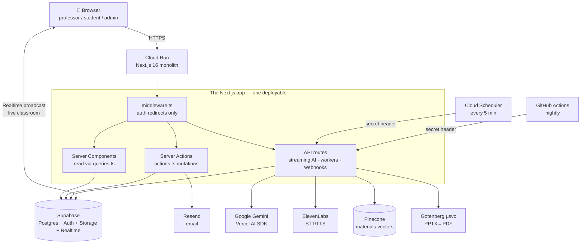
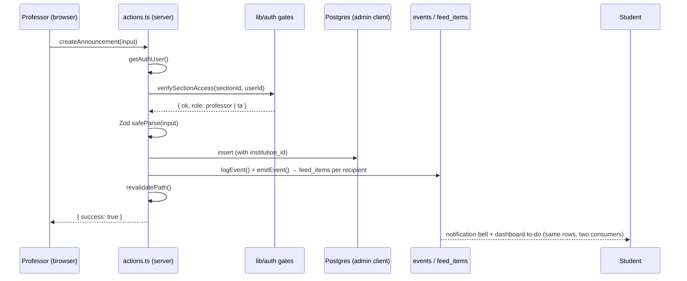
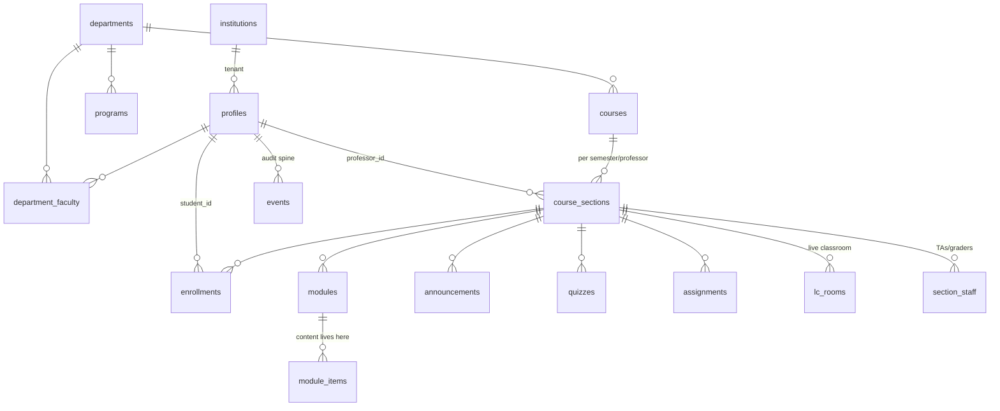
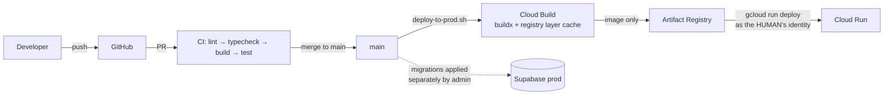

# 🏗️ Architecture Guide

> A visual and narrative guide to how Scholera is designed, why these choices were made, and how everything fits together.

## 📊 Architecture at a Glance



## 🎯 System Overview

### What We're Building

Scholera is a **multi-tenant AI-native LMS** (institutions → professors/students/staff/admins) built as a **single Next.js monolith on Cloud Run**, with Supabase supplying Postgres, auth, file storage, and realtime — and AI (Google Gemini) woven into authoring, tutoring, grading, and analytics rather than bolted on. There are no microservices except one stateless PPTX→PDF converter.

### Key Architectural Decisions

1. **Monolith, not microservices** — one Next.js app owns UI, mutations, AI streaming, and background workers. `infra/README.md` states this explicitly. Less to operate for a small fast-shipping team.
2. **Supabase as the platform** — auth + Postgres + storage + realtime in one, with Row-Level Security as the database-layer tenant wall (`docs/archive/decisions.md`).
3. **Server actions over REST for mutations** — each feature page co-locates an `actions.ts`; API routes exist only where actions can't do the job (streaming, secret-authed workers, webhooks, tokens).
4. **Authorization in code, RLS as backstop** — mutations run on the RLS-bypassing admin client *after* explicit gates (`src/lib/auth/`). This is deliberate: gates compose (role + section + tenant + feature), and RLS remains defense-in-depth.
5. **Postgres is the source of truth; everything else is a rebuildable projection** — Pinecone vectors, extraction jsonb, `skill_mastery`, insights summaries can all be regenerated.
6. **Background work = durable queue tables + route-kicked workers** — not a job framework. `background_jobs` / `extraction_jobs` rows, atomic claims, workers drained by app calls plus Cloud Scheduler sweeps.
7. **AI proposes, humans commit** — Athena's draft tools deliberately have no `execute`; mutation happens only when the professor approves a card, through the same independently-authorized server actions their hands would use.

### Design Principles

- **Simplest thing that solves it correctly** (`CLAUDE.md`) — smallest correct diff, reuse before writing, registries as extension points
- **Purity split** — nearly every domain separates a pure, unit-testable core from a thin I/O shell
- **Idempotency by construction** — claim-then-act sweeps, unique-index-guarded enqueues, content-hash freshness checks
- **Telemetry never breaks the feature** — `logEvent`, `emitEvent`, cost recording are all fire-and-forget

## 📚 Architectural Layers

### Presentation — Server Components by default

```
┌────────────────────────────────────────────────┐
│  src/app/**/page.tsx (RSC — data fetching)     │
│  src/components/** ('use client' — interaction)│
│  ui/ primitives → shared/ → role trees         │
└────────────────────────────────────────────────┘
```
- Server components fetch via `queries.ts` and pass data down; `'use client'` only for hooks/events/browser APIs
- Layouts do **authorization** (render `DeadEnd` on denial — never redirect); `middleware.ts` does **authentication** redirects, and nothing else does
- Design system: Tailwind v4 (CSS-first, no tailwind.config) + shadcn (new-york, neutral) + house primitives; semantic tokens only, no raw color classes

### Application — Server Actions + API routes

```
┌────────────────────────────────────────────────┐
│  actions.ts ('use server') — all mutations     │
│  api/*/route.ts — streaming, workers, webhooks │
└────────────────────────────────────────────────┘
```

**Every mutating action follows one sequence:**

```
getAuthUser() → verify (section-access / enrollment / admin-context / tenant-owns)
             → createAdminClient()
             → Zod safeParse the input
             → DB op (institution_id on every tenant-scoped write)
             → logEvent() → revalidatePath()
             → return { success } | { error }     // never throw
```

API routes exist for exactly four reasons, each with its own auth style:

| Auth mechanism | Routes | Why not an action |
|---|---|---|
| **User session** (cookie → `getUser()` → same gates as actions) | `/api/chat`, `/api/professor-assistant(+upload)`, `/api/assignment-assistant`, `/api/quizzes/generate-stream`, `/api/assignments/ai-suggest-stream`, `/api/extraction/page`, `/api/live-classroom/render-deck`, `scribe-token`, `scribe-usage`, `converter-health` | Streaming responses / long durations |
| **Shared secret header** (timing-safe compare) | `/api/jobs-worker/kick`, `/api/extraction-worker/kick`, `/api/skills/recompute-sweep`, `/api/live-classroom/generate-insights`, `recording/finalize`, `/api/preclass-audio/generate` | Called by schedulers/kicks, no user present — the secret **is** the access control |
| **Opaque URL token** | `/api/feeds/[token]` (iCal) | Calendar clients can't send cookies |
| **Webhook signature** (svix HMAC) | `/api/webhooks/resend` | Third-party caller |

Plus `/auth/callback` (Supabase code exchange, open-redirect-hardened) and `/api/notifications/cron` (Scholera Pulse sweeps — **fails closed in prod** until Cloud Scheduler OIDC lands).

### Domain — `src/lib/`

38 domains, ~87k lines. The pattern that repeats: a **registry** defines the extension point (`course-features.ts`, `jobs/registry.ts`, `events/types.ts`, assignment template registry, artifact kinds), pure modules do the thinking, thin server modules do the I/O. See [6-file-insights.md](./6-file-insights.md).

### Data — Supabase + projections

```
┌─────────────────────────────────────────────────────┐
│ Postgres (~137 tables, RLS everywhere)  ← truth     │
│ Storage (private buckets + signed URLs)             │
│ Realtime (broadcast channels, JWT-authorized)       │
├─────────────────────────────────────────────────────┤
│ Rebuildable projections:                            │
│  Pinecone vectors · module_items.content.extraction │
│  skill_mastery · insight summaries · quiz_item_stats│
└─────────────────────────────────────────────────────┘
```

## 🔄 Data Flow Patterns

### A mutation, end to end (professor posts an announcement)



### Realtime (Live Classroom) — snapshot + broadcast + replay

The flagship realtime feature runs on **Supabase Broadcast** (migrated off `postgres_changes`), one resilient channel per room with two topics:

```
join/refresh:  getRoomSnapshot(roomId)  ──►  durable state + lastSeq anchor
live:          authoritative topic  ← DB triggers emit sequenced envelopes (persisted to lc_events)
               ephemeral topic      ← client-emitted strokes/reactions (never persisted)
reconnect:     getEventsSince(lastSeq) replay → dedupe by seq → converge
```

Security property: quiz answers are stripped **server-side by the DB trigger** before broadcast, and the projector view fetches only the viewer-safe snapshot — a student (or the lecture-hall screen) can never receive an answer key.

### Background work — queue tables + kicked workers

```
feature code ──enqueue (idempotent insert)──► background_jobs / extraction_jobs
     │                                              ▲
     └──fire-and-forget kick──► /api/*-worker/kick ─┘ (atomic claim, FOR UPDATE SKIP LOCKED,
                                                        drain until empty or near maxDuration)
Cloud Scheduler (every 5 min) ──secret header──► same kick routes   ← the safety net
GitHub Actions (nightly) ──► /api/skills/recompute-sweep            ← mastery backstop
```

Pipelines plug into `jobs/registry.ts`: `embed_material` (Pinecone sync — convergent: create/re-upload/delete all enqueue the same reconciling job), `render_scheduled_deck`, `node_check_pool`, `outcome_alignment` (a cached map/reduce over course evidence), `regenerate_student_insights`.

### The AI content pipeline (what makes it "AI-native")

```
professor uploads lecture file
  → extraction_jobs → document-parser (deterministic pdfjs/fflate first, vision only as gated fallback)
  → module_items.content.extraction  (text pages, images, formulas, tables, concepts)
      ├─► embed_material job → Pinecone (per-(institution, section) namespace)
      ├─► quiz generation (concept-first, with page-level source citations)
      ├─► AI tutor retrieval (+ citation deep links back into modules)
      ├─► node checks, pre-class primer audio, skills reconciliation
      └─► live-classroom deck render + lecture context
```

One extraction feeds everything downstream — that's why the worker and its stored shape are treated as critical infrastructure.

## 🎨 Design Patterns

| Pattern | Where | Why |
|---|---|---|
| **Query-layer DI** — every query takes `SupabaseClient` first, catches, returns fallback | `lib/supabase/queries.ts` (27 groups) | Callers choose RLS-client vs admin-client; UI never sees a throw |
| **Registry as extension point** | `course-features.ts`, `jobs/registry.ts`, `events/types.ts`, template/artifact registries | Adding a feature = one entry + one adapter, not a refactor |
| **Purity split** | `triage.ts`/`roadmap-signals.ts`, `report/compute.ts`/`actions.ts`, `zip.ts`/`zip-reader.ts`, … | Logic is unit-testable without a DB; I/O shells stay thin |
| **Claim-then-act idempotency** | notification sweeps, workers, primers, digests | Sweeps re-run safely; concurrent instances can't double-send |
| **Draft tools without `execute`** (human-in-the-loop AI) | Athena professor console + authoring dock (assignments, quizzes, About page) | The model can only *propose*; the person commits via a normally-authorized action |
| **`'use server'` hygiene** | `room-auth.ts`, `grade-hook.ts`, etc. are *plain* server modules | Keeps internal helpers from becoming client-invocable endpoints |
| **Structural input bounding** | `ai/student-tutor/contract.ts` (`assertBoundedInput`) | No tool input may carry an identifier → prompt-reachable IDOR is impossible by construction |

## 💾 Data Architecture

### Core entity relationships



**`courses` vs `course_sections`** is the split to internalize: a course is the catalog entity; a *section* is one professor teaching it one semester — and almost everything (enrollment, modules, quizzes, staff, settings, Athena, vectors) hangs off the **section**.

### The ~137 tables, by domain

| Domain | ~Tables | Highlights |
|---|---|---|
| Identity & tenancy | 8 | `institutions`, `profiles` (→ `auth.users`), `section_staff(_requests)`, `invite_redirects` |
| Academic core | 7 | `courses`, `course_sections`, `enrollments`, `modules`, `module_items` |
| Quizzes | 11 | `quizzes`, `quiz_questions/_attempts/_answers`, `quiz_item_stats`, proctoring logs/snapshots |
| Assignments | 10 | `assignments`, `assignment_submissions`, answer keys, AI grade suggestions, regrades |
| Live Classroom | 18 | `lc_rooms`, `lc_events`, `lc_interactions/_responses`, decks, transcriptions, recordings, insights |
| Roadmap / skills / outcomes | 12 | `roadmap_nodes/_edges`, `skills`, `skill_mastery(_snapshots)`, node checks, ABET alignment |
| Projects | 14+ | teams, phases, docs, chat, meetings, showcase |
| AI / Athena / RAG | 9 | `athena_conversations/_messages/_artifacts`, `ai_usage_events`, `material_vector_chunks`, job queues |
| Messaging & notifications | 10 | discussions, DMs, `app_notifications`, `feed_items`, primers, feedback |
| Calendar | 6 | office hours, bookings, blocked times, personal events, `calendar_tokens` |
| Course intel & social | 12 | reviews, Q&A, tips, votes, announcements interactions |
| Costs & misc | 8+ | `cost_analysis_ledgers`, `external_usage_events`, provider bill snapshots, badges/challenges |

### Migration strategy

- `supabase/migrations/` (236 files) **is** the schema — `git pull` + `supabase db reset` reproduces prod locally; no maintained snapshot to drift
- New migrations: `npx supabase migration new <name>` (timestamped — hand-numbering collides across branches)
- RLS is enabled **in the same migration that creates a table**; policies use `DROP POLICY IF EXISTS` before `CREATE` (Postgres has no `CREATE POLICY IF NOT EXISTS`)
- Contributors write migration files; **an admin applies them to prod** — the deploy script ships app code only

## 🔒 Security Architecture

```
┌──────────────────────────────────────────────────────────┐
│ Transport: HTTPS (Cloud Run) · anti-framing headers      │
│   (SAMEORIGIN / frame-ancestors 'self', app-wide)        │
├──────────────────────────────────────────────────────────┤
│ AuthN: Supabase Auth (invite-only; /signup disabled)     │
│   middleware.ts = the only redirect layer; getUser()     │
│   validates server-side, never trusts the local JWT      │
├──────────────────────────────────────────────────────────┤
│ AuthZ (the real gate — in code):                         │
│   role layouts render DeadEnd · lib/auth/ helpers        │
│   (admin-context, section-access, tenant-context,        │
│    assert-tenant-owns) · verifyFeatureEnabled            │
│   every action re-verifies; the client is untrusted      │
├──────────────────────────────────────────────────────────┤
│ Tenant isolation:                                        │
│   RLS scoped by institution_id + role (backstop)         │
│   institution_id on every tenant-scoped write            │
│   DB tenant-match guard triggers on courses/sections     │
│   Pinecone: namespaceFor(institution, section) — the     │
│   wrapper never accepts a raw namespace                  │
├──────────────────────────────────────────────────────────┤
│ Storage: private buckets · render-time signed URLs with  │
│   per-surface TTLs · uploads flow through server actions │
│   (browser never writes storage directly)                │
├──────────────────────────────────────────────────────────┤
│ Secrets: server-only (no NEXT_PUBLIC_*, no client tree)  │
│   worker routes use timing-safe shared-secret compares   │
└──────────────────────────────────────────────────────────┘
```

Battle-tested details worth knowing (each has a regression test in `src/__tests__/`):
- `/auth/callback` accepts `redirect_to` only as a same-origin `"/path"` (open-redirect hardening)
- The CWID login flow only resolves a CWID→email for a caller who supplies that account's password (enumeration-oracle fix)
- `/i/[shortId]` invite links redirect via `useEffect`, never `<a href>`, so email scanners can't pre-redeem single-use tokens
- Live-quiz answers are stripped by a DB trigger before broadcast; the projector renders no interaction content at all
- `DeadEnd` variant choice is a tenancy decision: anything keyed by a resource ID renders `missing`, never "no access" (existence leak)

The full checklists live in `.claude/rules/security-*.md` and are treated as blocking in review. The stack context (`docs/research/ai-coding-assistant-security-threats.md`): Next.js + client-reachable Supabase + RLS multi-tenancy is exactly the architecture behind the largest AI-shipped-code breaches — hence the paranoia.

## 🚀 Deployment Architecture

```
Production                              Staging
├── Cloud Run "scholera"                ├── Cloud Run "scholera-staging"
│   us-central1 · 4Gi/2CPU · 0–10 inst  │   isolated FREE-TIER Supabase project
│   port 8080 · 900s timeout            │   secrets via GCP Secret Manager
├── Supabase project (prod)             │   hard-refuses the prod Supabase ref
├── Cloud Scheduler: jobs-worker-sweep  └── deploy-to-staging.sh (WIP allowed)
│   + extraction-worker-sweep (*/5)
├── Gotenberg deck-converter (separate  Local
│   Cloud Run svc, IAM-locked,          ├── supabase start (Docker)
│   --concurrency=1 — LibreOffice)      ├── scripts/dev-setup/setup-local.sh
└── deploy-to-prod.sh (human-gated)     └── npm run dev
```



Deliberate choices: the Cloud Build service account **cannot deploy** (build/deploy split keeps deploys gated on human gcloud access); `Dockerfile` defaults its `NEXT_PUBLIC_*` args to prod values so a lazy build is a prod build, never an accidental staging one; the runner image ships headless LibreOffice + metric-compatible fonts for in-app deck conversion; queue sweeps moved from GitHub Actions to Cloud Scheduler after an Actions-billing lapse silently stopped every workflow — a core invariant ("the queue always drains") now lives next to the runtime.

## ⚡ Performance Considerations

- **Signed-URL TTLs per surface** (materials 1h, live classroom 6h, chat 15m) with batched signing (50 attachments = 1 API call); the projector refreshes URLs ~15 min before expiry so a lecture never 401s mid-class
- **`readAllPages()`** wherever an aggregate needs every row — PostgREST silently caps at 1000, which corrupts averages, not just truncates lists
- **Broadcast over `postgres_changes`** for the classroom: DB triggers fan out once; strokes go client-to-client with no server hop; known ceiling documented in `e2e/load/` (100 students × 30 Hz strokes ≈ 3000 msg/s vs the plan's ~2500 cap — mitigations on file)
- **AI cost discipline**: per-feature model constants (flash for the workhorse paths, flash-lite for node checks), prompt prefixes ordered for cache warmth, content-hash guards so unchanged inputs make zero model calls, per-(user, scope) daily rate limits, and every call recorded to the cost ledger at the dated rate
- **Build**: buildx registry layer cache (Kaniko evaluated and rejected — documented in `cloudbuild.yaml`)

## 📊 Monitoring & Observability

- `logger.*` with `Component.function` sources — error/warn/info ship to Cloud Run logs; debug is dev-only
- `events` table — the universal audit/analytics spine (every mutation `logEvent`s)
- `ai_usage_events` + `external_usage_events` + provider bill snapshots → the super-admin **Cost Analysis** page reconciles metered spend against actual vendor bills and shows the gap rather than hiding it
- Live-classroom broadcast has its own observability module (state transitions, replays, dedupes, spoof rejections at info/warn)
- `/admin/extraction-jobs` — bookmark-only queue observability page

## 🔮 Current Limitations & Known Debt

Honest map of what a newcomer will trip over (all verified in code as of 2026-08-18):

1. **`/api/notifications/cron` fails closed in prod** — the Scholera Pulse sweeps (deferred publishes, digests, re-engagement, reminders) don't run in production until Cloud Scheduler OIDC verification lands. Local stand-ins exist in `scripts/dev-setup/pulse-*`.
2. **The Knowledge Warehouse is withdrawn** — `/professor/warehouse` renders a closed door; its persistence layer was a localStorage mock. `lib/calendar/storage.ts` is a similar localStorage stub.
3. **`lib/grades/` is dead code pending #464** — the weighted-gradebook engine is reachable only from tests, kept for the resurrection PR.
4. **The Playwright seed is broken** (`db:seed:e2e` predates required `institution_id`) — `playwright.todos.config.ts` exists solely to route around it.
5. **Stale docs that read authoritative**: root `CONTEXT.md` and `docs/archive/decisions.md` are frozen at Feb 2026; `docs/archive/schema.sql` contradicts the real base migration. Several feature `CONTEXT.md`/README files inside `src/` lag their folders. The real design record is the "why it is this way" comments in scripts/configs.
6. **Two adaptive-quiz engines coexist**: the Elo engine is wired out (IP reasons, `archive/ADAPTIVE-WIREOUT.md`); **CCAT/IRT v2 is live and intentional** — "adaptive is gone" is false.
7. **Missing referenced files**: `supabase/seed.sql`, `scripts/e2e-prep-local.sh`, `docs/DATABASE.md` are referenced but don't exist.

## 📋 Quick Reference

### Key decisions at a glance

| Area | Choice | Alternative considered | Why |
|---|---|---|---|
| Shape | Monolith on Cloud Run | Microservices | Small team; one thing to operate |
| Backend | Supabase | Roll-your-own Postgres + auth | Auth/Storage/Realtime included; RLS |
| Mutations | Server actions | REST API layer | Co-location, type-safety, less surface |
| AuthZ | Code gates + admin client | Pure RLS | Composable checks; RLS stays as backstop |
| Vectors | Pinecone, wrapper-only access | pgvector everywhere | Serverless scaling; namespace = tenant wall (decided 2026-07-17) |
| Background jobs | Queue tables + kicked routes | Cloud Tasks / queues | No new infra; Scheduler sweeps as safety net |
| AI provider | Gemini via Vercel AI SDK | Multi-provider | One SDK seam; per-feature model constants make swaps one-line |

### Common tasks — where to start

- **Add a page** → `src/app/(dashboard)/<role>/…/page.tsx` (server component) + co-located `actions.ts`
- **Add a mutation** → follow the canonical action sequence; add an `actions-*.test.ts`
- **Change the schema** → `npx supabase migration new`, RLS in the same file, re-run `setup-local.sh`
- **Add a course feature tab** → entry in `src/lib/course-features.ts` + a route page
- **Add a background pipeline** → implement `BackgroundPipeline`, register in `src/lib/jobs/registry.ts`
- **Add an event/notification type** → `src/lib/events/types.ts`, emit via `emitEvent`
- **Touch anything vector** → read `.claude/rules/vector-db.md` first; index config is immutable

## 📚 Next Steps

- File-level detail → [6-file-insights.md](./6-file-insights.md)
- Domain vocabulary → [3-concepts.md](./3-concepts.md)
- The complete file map → [4-visual-tree.md](./4-visual-tree.md)
