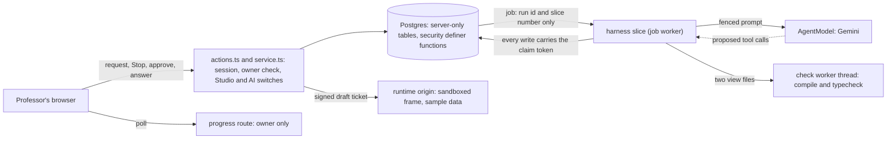

# Studio Builder: the Agent Harness

A professor describes a teaching tool, and Athena builds it. This document is how that works: what the model may do, what Scholera decides, what is stored, and why a build can't reach students on its own. Rule numbers cite [studio-plugin-rules.md](./studio-plugin-rules.md), which wins any disagreement. The working design this came from is `docs/designs/studio/studio-agent-harness.md` (local, gitignored).

| | |
|---|---|
| **Status** | Step 7C: accepted on a local PostgreSQL 17 with real PostgREST; real Supabase and the live Cloud Run settings still pending (see [Verification](#verification)) |
| **Owner** | Kevin Dohsi |
| **Date** | 2026-10-02 |
| **Migration** | `supabase/migrations/20261002160000_studio_builder.sql` |
| **Code** | `src/lib/studio/builder/`, the builder section of `src/lib/studio/db.ts`, `builderActor` in `src/lib/studio/context.ts`, `publishDraft` in `src/lib/studio/lifecycle.ts`, the draft frame in `src/lib/studio/runtime/frame{,-ticket}.ts`, the builder UI in `src/components/studio/builder/` |
| **Endpoints** | `src/app/(dashboard)/professor/courses/[sectionId]/studio/actions.ts`, `GET /api/studio/builder/runs/[runId]`, `GET /studio-frame/v1/draft/[projectId]/[view]` (runtime origin only) |

## The one rule

The model proposes. Scholera decides which actions exist, validates every argument, runs every effect, and ends every run. Nothing the model writes, including text that looks like an instruction, can change that, because no tool exists for anything outside the list below.

The furthest a build can go on its own is `preview_ready`: a new draft the professor can preview on sample data. Saving it as a version is a separate professor click. Installing, activating and showing it to students are the Step 5 actions in [studio-plugin-publication.md](./studio-plugin-publication.md), which no builder code imports.

## Trust boundary

Dotted arrows carry model output. Each ends at code that validates it.

| Input | Why it is untrusted | How it is contained |
|---|---|---|
| The professor's request and answers | Free text | At most 4000 characters, control and bidi characters refused, never logged |
| Model tool calls | The model can be wrong or steered | Only nine tools exist. Each argument is a flat strict schema; paths are a two-value enum; no argument names an id or scope |
| Generated code | It may be broken, insecure or written to exfiltrate | Scholera compiles it, typechecks it against a hand-written environment, runs Stage 1, and it only ever runs in the Step 4 sandbox |
| Generated manifest | It is the plugin's whole escalation surface | Parsed, owned fields stamped, diffed and classified; escalations wait for the professor |
| Course labels and skill names | Skill names can come from uploaded files | Entered as fenced data with provenance `course-data`, below the professor in the authority order |

## What is stored

Four new server-only tables: RLS on with no policies, every client grant revoked, `service_role` only. Only `db.ts` names them (`studio-table-access.test.ts`).

| Table | One row is | Notes |
|---|---|---|
| `studio_plugin_snapshots` | One immutable draft state, keyed by `(project_id, hash)` | Refuses UPDATE. Holds the stamped manifest, the two view sources, both compiled bundles and the check summary |
| `studio_plugin_builder_runs` | One build: one professor message | Lifecycle, the private working copy (`work`), plan, approval card, questions, counters and cost, the claim token, the result |
| `studio_plugin_builder_steps` | One observable action | Append-only. Unique on `(run_id, seq)` and `(run_id, tool_call_id)` |
| `studio_plugin_builder_spend` | The cost of one model call | Append-only. The school's daily cap sums it (see [Budgets](#budgets-the-kill-switch-and-entitlement)) |

Changes to Step 1 tables: `studio_plugin_projects.draft` (never used) is replaced by `draft_head_hash`, `draft_rev` and `draft_undo_hash`, each hash with a composite key to the project's own snapshots. `studio_plugin_versions` gains `source_snapshot_hash`, unique per project, so every saved version names the draft it came from and the same draft can't be saved twice.

There is no conversations or messages table. A project's conversation is its runs in order: each run's `request` and its result's `summary`. Professor answers live in the run's `questions`.

Never stored: hidden reasoning, prompts, provider responses, file content in steps, plan text in steps, student names. Step summaries hold paths, byte counts, 16-character content hashes, enum values and reason codes.

## Snapshots and the draft pointer

A snapshot's hash is the SHA-256 of the canonical JSON (keys sorted at every level) of `{format: 'studio-draft-v1', compiler, manifest, files}`. The compiler id (`studio-tsx-v1+ts<version>`) is part of it, so a TypeScript upgrade can't reuse stored bundles. Timestamps, run ids and check results are not part of it, so identical content always has the same hash.

A build:

1. starts from the project's current snapshot (its `base_hash` and `base_rev`);
2. edits a private copy in `runs.work`, which nothing outside the run can see;
3. on a successful finish only, writes one snapshot and moves the pointer in `studio_builder_end`.

That function locks the project row (the same lock a publish takes), requires `draft_rev` to still equal the run's `base_rev`, inserts the snapshot, then moves the pointer, records the old head in `draft_undo_hash` and increments the revision. If the draft moved during the run, the run ends `blocked` with `draft_changed` and nothing is overwritten. Stop, failures, budget limits and validation failures save nothing.

Every function that takes both locks takes the project row first, then the run row: `studio_builder_start`, `studio_builder_undo` and the commit in `studio_builder_end`. A start racing a commit waits instead of deadlocking. A real-Postgres test holds the project lock and checks the run row is still free.

### Undo and draft history

Undo moves the pointer back one step, to the snapshot that was the draft before the last successful build. `studio_builder_undo` takes the expected head and revision, locks the project row and answers:

| Outcome | When |
|---|---|
| `undone` | The pointer moved: head becomes the undo target, the target is cleared, the revision goes up by one |
| `busy` | Any run of the project is queued, running or waiting. Undo never moves the draft behind an active run; stop it first |
| `draft_changed` | The expected head or revision is stale |
| `unavailable` | There is no undo target: the first build, or an undo already used |
| `not_owner`, `archived` | The project isn't the professor's, or is archived |

It is one step on purpose. After an undo there is nothing to redo or undo until the next successful build. Nothing is deleted: snapshots stay, saved versions are untouched, and the newer draft stays in the history list. The server action audits each undo with `logEvent` (project, short from and to hashes).

The draft history (`listDraftHistory`, owner only) lists up to 20 snapshots the project's builds made, newest first. Each entry has its time, the run that made it, the professor's own request cut to 120 characters, and markers for the current draft, the undo target and a saved version. It never holds model text (plan, note, questions), source, manifests or check details beyond pass or fail.

Published versions stay what they were: immutable release artifacts. A snapshot is development history; a version is what an installation runs.

## Run states

The database enforces the state machine with a trigger (`studio_builder_runs_transition`). A finished run never changes again, except that late spend still adds to its cost.

| Status | Kind | Meaning |
|---|---|---|
| `queued` | active | Waiting for a worker to claim the next slice |
| `running` | active | A slice holds the run (it has the claim token) |
| `waiting_for_approval` | active | Paused on a manifest approval card. No job, no claim |
| `waiting_for_professor` | active | Paused on a question. The professor's answer resumes the same run |
| `preview_ready` | terminal | The completion gate passed and a new snapshot is the draft |
| `completed` | terminal | The gate passed, but nothing differed from the starting draft |
| `blocked` | terminal | The model gave up (`agent_blocked`), checks never passed (`repair_rounds`, `same_finding`, `check_runs`), the draft moved (`draft_changed`), or a gate refused mid-run (`studio_paused`, `not_entitled`, `ai_disabled`, `access_lost`, `project_archived`) |
| `cancelled` | terminal | Stop, an expired card or question (`expired`), or replaced on the professor's confirmation (`superseded`) |
| `budget_exhausted` | terminal | A run budget ran out (`limit_*`) |
| `failed` | terminal | Repeated malformed or refused calls, the model unavailable, a check timeout, too many interruptions, or a harness fault |

Allowed moves: `queued` to `running`, `cancelled` or `failed`; `running` to any status; either waiting state to `queued` or `cancelled`. Phases (`understanding`, `planning`, `editing`, `checking`, `repairing`) only drive progress copy.

One active run per project, by a partial unique index. A new request while a run is queued or running is refused with the running run's id. A new request while a run is waiting for the professor returns a conflict; only a second request that names the waiting run (`replaceRunId`, sent after the professor confirms "Replace it") cancels it as `superseded`, and its trajectory stays.

## Where a build runs

Each build runs as checkpointed slices on the existing `background_jobs` queue (job type `studio_builder_slice`, params `{runId, sliceNo}`, no section, so a TA who can read section jobs reads nothing). With no section, the existing `background_jobs` policy lets the school's admins read the row: the run id, who started it, timestamps, and a fixed word for how the slice ended. That matches what they already see of institution-level jobs, and the run id opens nothing because the progress route is owner-only. Accepted as is. A slice:

1. claims the run with `studio_builder_claim`, which writes a fresh claim token;
2. heartbeats every 5 seconds; a lost claim or a Stop aborts the model call in flight;
3. runs turns while it has time, persisting every step as it goes;
4. hands off to a new slice (`studio_builder_handoff`), pauses, or ends.

Nothing that steers the run lives only in memory. A crashed instance costs at most one re-asked model turn: the next claim marks any calls the interrupted turn proposed but never recorded as `interrupted`, and rebuilds context from the database. A slice silent for 60 seconds can be re-claimed, at most twice (`failed`, `interrupted` after that). The progress read requeues a stalled run.

Every write a slice makes carries its claim token. Once another slice holds the run, every write from the old one is refused; only its model spend still reaches the run's cost.

### Cloud Run and CPU

What the repo sets (`infra/app/deploy-to-prod.sh`, `deploy-to-staging.sh`, `setup-sweep-schedulers.sh`): a 900-second request timeout, 4 GiB and 2 vCPU, 0 to 10 instances in production (0 to 2 on staging), and a Cloud Scheduler sweep every 5 minutes with a 600-second attempt deadline. Neither CPU flag is passed, so the service runs on Cloud Run's default, request-based CPU: an instance has CPU only while it is processing a request. Whether anyone changed that by hand can only be read from the live service (`gcloud run services describe scholera --region us-central1 --format=export`, field `run.googleapis.com/cpu-throttling`).

So nothing in a build runs on CPU that outlives a request:

- Every kick is awaited by its caller (`kickWorker`), so the request leaves while the caller's own request still has CPU. It is abandoned after 2 seconds. The drain it starts is its own request to the service, with its own CPU, until it answers or reaches the 900-second timeout. Google documents that a client disconnect isn't passed to the container. That the drain keeps its CPU after the client has gone is an inference from the request-based billing docs, to confirm once on staging with a build longer than 5 minutes.
- A slice is capped at 480 seconds (`STUDIO_BUILDER_SLICE_MAX_MS`), and no model turn starts in its last 270 seconds, so it ends well inside the drain's 900 seconds.
- If an instance stalls or dies mid-slice, correctness holds: the claim token fences the stalled slice out. The professor's progress read requeues a run whose heartbeat is 60 seconds old, at most twice. Without an open page, the sweep re-claims the job once its 900-second claim expires.

Step 7B kicked with a `hold` option that left the request open instead of awaiting it. Under request-based CPU that request might never be sent once the caller had answered, and Node's fetch gives up after 300 seconds without response headers anyway. The option is gone.

If staging shows slices stalling, the next step is a Cloud Tasks kick (a dispatch deadline up to 30 minutes, task creation awaited inside the request). `--no-cpu-throttling` is the last resort, because it bills every 4 GiB instance for its whole life. Slices don't change under either.

Shared worker changes, all additive: the drain's deadline reaches pipelines as `ctx.deadline`; a pipeline can declare `minBudgetMs` and a drain with less time left doesn't claim that type; a worker only writes completion for a job it still holds (`claimed_by`); `kickWorker` is exported. Existing pipelines behave as before (`jobs-worker.test.ts`).

Staging needs `BACKGROUND_JOBS_SECRET`, `BACKGROUND_JOBS_KICK_URL` (on the app host, never the runtime origin), `STUDIO_RUNTIME_ORIGIN`, `STUDIO_FRAME_TICKET_SECRET` and a sweep job before builds and previews work there. `deploy-to-staging.sh` passes `--set-env-vars` and `--set-secrets`, which replace every variable on each deploy, so these have to go into that script rather than be set by hand. `infra/app/README.md` lists each setting and what happens when it is missing. Every missing setting makes the builder refuse, or end the run with a fixed reason (`studio-builder-config.test.ts`).

## The tools

The model sees the same nine tools every turn. There is no shell, filesystem, network, database, publication, activation, visibility, entitlement or binding tool.

| Tool | Does | Limits |
|---|---|---|
| `read_file` | Shows one view in the next turn | Path is `views/student.tsx` or `views/professor.tsx`, nothing else |
| `get_kit_reference` | Shows one kit component's props and usage | Enum of the importable kit names |
| `write_file` | Replaces a whole view in the working copy | 32 KiB; well-formed text with no NUL, controls or bidi characters |
| `edit_file` | Replaces exactly one occurrence of `old_text` | Only in a view the model has read |
| `propose_manifest_change` | The only path to the manifest (below) | 32 KiB of JSON |
| `run_checks` | Compile, typecheck, Stage 1, builder checks | The model can't choose or skip checks. Unchanged work returns the cached result |
| `submit_plan` | Records goal, files, manifest changes, checks | Plain text, at most 8 KiB. A plan grants nothing |
| `ask_professor` | Pauses for one answer | At most 2 per run |
| `finish` | Asks to end: `completed` or `blocked` with a summary | `completed` triggers the harness's own gate |

Refusals use one vocabulary (`RefusalCode` in `tools.ts`), each with a fixed hint for the next turn. A plan is required before any manifest change, before writing on a first build, and before changing both views; on a first build the manifest must exist before any view is written.

Calls in a turn run in the order proposed, except `run_checks` runs after the turn's writes and `finish` or `ask_professor` runs last. At most 8 calls per turn; the rest are refused together as one error.

## The manifest and approval

`propose_manifest_change` parses the JSON, refuses control and bidi characters anywhere, and stamps what Scholera owns (`manifestVersion` 2, `id` from the project slug, `version` `0.0.0`, `bridgeVersion` `v1`, both view entries). It then validates with `parseManifest`, refuses capabilities without a Bridge method (today `course.weakSpots`), refuses changes to collections a published version declared, and screens the wording with `deterministicPurpose`.

It then diffs the proposal against the working copy and classifies every change:

| Needs the professor's approval | Applies directly, listed on the result |
|---|---|
| A capability added to a view (counted per view) | Name, description, purpose summary, skill slot labels |
| A signal added | Removing a capability, signal, skill slot or unpublished collection |
| A collection added | Field changes on an unpublished collection |
| Any access change on an unpublished collection | The AI fallback |
| A skill slot added | |
| A purpose category or audience change (so a first build always asks once) | |

An approval card is bound to exactly one proposal: a fresh `proposal_id`, the `delta_hash` of `(base revision, base manifest, proposed manifest)`, and the working copy's revision. `studio_builder_decide` checks all three, the 72-hour expiry, and that no decision exists yet (the decision is a step keyed `approval:<proposal_id>`). Approving needs room under the school's live-run cap. A replayed or stale decision is refused, and a re-proposed change gets a new card. Card lines come only from fixed tables and checked keys, never from the model's words. Athena's plan is not shown on the card.

Approving a card lets the build continue. It is not the rule 8.2 approval, which still happens at install and activation.

## Checks and repair

The draft gate (`checks.ts`), in a fixed order:

1. Compile both views (the check worker). The compiler accepts named imports from `react` and `@scholera/plugin-kit` only, one named default export, and never the reserved `ScholeraKit` name. It emits the canonical classic-script bundle and checks it parses with no module syntax.
2. Typecheck both views against `kit/plugin-kit-types.ts` alone (`noLib`, `strict`, `noUnusedLocals`). There is no DOM, Node or Scholera type to reach.
3. Stage 1 static checks from the validator, on the artifact a Save would publish, minus `artifact.hash` (always matches) and `edtech.purpose` (the AI classifier runs at Save, never in the loop). A `needs_review` outcome blocks.
4. Builder checks: the manifest is valid, available and compatible; the purpose wording passes `deterministicPurpose`; and no student's full name (across every section the owner teaches) appears in code or manifest. The roster check fails closed when the roster can't be read, and never quotes the name.

Stage 2 (the browser) never runs in the loop. It stays with publication.

The check worker is a worker thread started from a generated string (`check-worker.generated.ts`, built by `scripts/studio/build-check-worker.mjs`; a test fails if it is stale). It gets none of the server's environment, arguments or Node flags, is capped at 512 MB of heap and 10 seconds per call, and is terminated and replaced on a timeout or crash. The run then ends `failed` (`check_timeout`) and saves nothing. The worker suite passes on Node 22.23.3, the major version the `node:22-slim` image runs.

Findings return to the model as bounded data: at most 40, ordered required-first and by severity, each with a fixed hint, inside a fenced `check-output` block.

Repair is bounded:

- 3 repair rounds;
- 6 check runs;
- a blocking finding (check and file) that survives 2 repairs ends the run (`same_finding`).

`finish(completed)` never trusts the model. The harness re-checks the plan requirement and re-runs the gate if anything changed since the last check. A failing gate counts as a repair round. Only a passing gate saves a snapshot, and the bundles saved are the trusted compiler's output for exactly those files.

## Context

Every turn rebuilds the prompt from durable state (`context-builder.ts`, pure). The stable instructions (`instructions.ts`, versioned `studio-builder-l1-v2`) are the same bytes on every turn and hold no project data. The prompt holds, from least to most volatile:

1. The manifest's structure, unfenced, and its own words, fenced.
2. The file map, frozen collections and available capabilities.
3. The last 3 builds of the project.
4. The course code and title, plus skill names only when the request is about skills.
5. The kit references the model asked for.
6. The files it has read, with line numbers.
7. The latest findings.
8. The action log and refusal hints, the plan, and the remaining budgets.
9. Last, the professor's request and answers.

Everything not written by Scholera or the professor sits inside a `<data_NONCE>` block with a provenance attribute (`plugin-code`, `check-output`, `course-data`, `earlier-request`, `model-authored`). The nonce changes per prompt, and text inside a block can't close it (`fenceBlock` in `prompt-fence.ts`).

The authority order, stated in the instructions and enforced by what tools exist, is:

1. platform rules;
2. tool schemas and policies;
3. project facts;
4. the professor's request;
5. retrieved content;
6. generated output.

No id (tenant, section, user, project, run), student data, course material, secret or URL ever enters a prompt. The prompt is held to 64,000 estimated tokens by fixed trims, in order: history, skills, the action log, kit references, findings.

There is no long-term project memory in Step 7B.

## Budgets, the kill switch and entitlement

Named settings in the builder section of `src/lib/studio/limits.ts`; the database functions take them as arguments.

| Scope | Limit |
|---|---|
| Per run | 24 model turns, 48 tool calls, 30 writes, 256 KiB written, 20 minutes of active time, $2.50 |
| Per professor | 15 builds in any 24 hours |
| Per school | 3 builds queued or running at once, $100 of builder spend in any 24 hours |

Before every model call the harness checks, fresh:

- the run is running, this slice holds it, and nobody pressed Stop;
- the professor still has the section as its professor, and the project is active and theirs (`builderActor`, a brand not assignable to `StudioProfessor`);
- Studio is on and the school has the `studio` entitlement (`studioAccess`);
- the `studio-builder` AI switch is on (a new group in `ai-features.ts`);
- the school's 24-hour builder spend leaves room for one more call;
- every run budget, including the run's spend plus a worst-case next call ($0.42 at Pro rates).

Turning the AI switch off stops every build at its next model call.

Spend is recorded in three places, for different jobs:

- The usage ledger row (`recordAiUsage`, feature `studio_builder`, the run id in metadata) is what the provider reported.
- `studio_builder_add_cost` runs the moment a reply lands, before anything else. It adds to the run's counter, which the per-run cap reads, and writes a `studio_plugin_builder_spend` row, which the school's daily cap sums by when it was spent. It runs whatever state the run is in, so a reply that lands after Stop, after a lost claim or after the run ended still counts.
- The model-turn step carries the same cost, for the trajectory only.

A call whose usage never comes back (a timeout, or a call cut off by Stop or a lost claim) is charged to both caps at the worst case for one call ($0.42 at Pro rates), since the provider may still bill it. The ledger keeps what the provider reported.

Token semantics are the shared ledger's (`TokenUsage` in `src/lib/ai/cost.ts`), fixed platform-wide in Step 7C. In AI SDK v6, `outputTokens` already includes reasoning tokens (`@ai-sdk/google` adds `thoughtsTokenCount` into it), so cost bills `outputTokens` at the output rate, and `reasoningTokens` is only the thinking share, never added again. Before the fix every thinking call was billed for its reasoning twice. The tool-loop surfaces (Athena's turn, the professor and assignment assistants) now record `totalUsage`, all steps, instead of the final step only. Rows written before the fix keep their stored cost; the dashboard sums stored cost and never recomputes it.

## Stop

Stop marks the run, and nothing else changes for the professor: their saved draft is untouched.

| Run state when Stop arrives | Effect |
|---|---|
| Queued, or waiting for the professor | Cancelled at once |
| Running, but its slice is dead (stale heartbeat, or its job finished) | Cancelled at once |
| Running, live | A durable flag. The heartbeat aborts the model call; every gate and every write refuses; the slice ends the run `cancelled` |

A commit that arrives after Stop also ends `cancelled`. The working copy is discarded and the draft pointer doesn't move. The run row, its steps, cost and timestamps stay.

## Idempotency

| Operation | Why a retry can't repeat it |
|---|---|
| A tool step | Unique `(run_id, tool_call_id)`; ids are generated by the harness (`<turn seq>.<index>`) |
| A working-copy write | The write names the revision it expects |
| A model turn | Not re-asked once recorded; before that, re-asked by design |
| A snapshot | `on conflict (project_id, hash) do nothing` |
| A commit | The run must be running with this token, and the draft at the run's base revision |
| A start | Unique `(owner_id, client_request_id)` |
| An approval or answer | Single-use step keys |
| A saved version | Unique `(project_id, source_snapshot_hash)` |

## Draft preview

`issueDraftPreview` (owner only) returns a frame URL for one view of one of the professor's own snapshots, plus the Bridge methods its manifest allows. The ticket is an HMAC over `{kind: 'draft', project, hash, view, expiry}` with a key derived just for drafts, so neither an installation ticket nor a draft ticket verifies as the other. The draft frame route checks the host, the ticket, the path and the Studio kill switch, loads the bundle by project and hash, and serves the same Step 4 document and headers. Every failure is the same 404.

The frame runs in `PluginHost` preview mode, on the in-memory preview bridge with sample records. It never reaches `/api/studio/bridge`, real records, publication or students.

## Save as version

`publishDraft` is the professor's "Save as version". It requires:

1. the professor owns the project;
2. Studio is on and the school has the entitlement;
3. the exact snapshot is still the draft;
4. it isn't already saved;
5. its stored content still hashes to its hash under the current compiler.

It re-runs the whole draft gate and rebuilds both bundles with the trusted compiler. Then it publishes through the same internal path as `publishVersion`, with the next version number (a minor bump, or 1.0.0) and `source_snapshot_hash`. Stage 1, with the real purpose classifier, runs on the new version as for any publish. Nothing is installed, activated or shown.

## Security invariants

Each has a test, and the starred ones also have a mutation test that removes the guarantee and confirms a test fails:

- No tool can name a file other than the two views, or any id (`studio-builder-units.test.ts`). ★ path allowlist
- The manifest can't be written as a file (the path enum), and changes that need approval never apply without one (harness tests). ★ approval requirement
- A model can't call a tool that doesn't exist, including any publication tool (harness tests, and an import-boundary test that builder modules never import publication, installation, record or binding code).
- Budgets and the kill switch are checked before every model call. ★ budget check
- Stop is observed during a model call. ★ cancellation
- A stale slice writes nothing (harness and database tests).
- The draft pointer never overwrites newer work. ★ CAS (database and harness)
- A decision can't be replayed onto another card (database and harness tests).
- Another professor, a TA or no session gets the same refusal from every entry point, and nothing from the progress read. ★ owner checks
- `finish` saves only what the harness's own gate passed. ★ final check
- The builder actor is not a `StudioProfessor` (a type-level test).
- Builder content (requests, source, trajectory, approvals, cost) has no client grant (database test).

## Evals

Two suites, kept apart (`eval/studio-builder/README.md`):

- **Deterministic**, part of `npm run test` (`studio-builder-harness.test.ts`, `studio-builder-recovery.test.ts`). A scripted model drives the real harness through every required scenario: a first build, a copy change, a two-view change, a capability approved and declined, compile and Stage 1 repairs, a repeated finding, forbidden tools and paths, Stop mid-call, a CAS conflict and prompt injection. It also covers a model that keeps asking questions past the cap, the cost cap with its worst-case next call, the turn cap, interruptions, provider timeouts and check-worker crashes.
- **Live**, `npm run eval:studio-builder` only. It runs the nine cases a script can't force against the real model, harness, gate and check worker, with the in-memory run store and a scripted professor. `--max-usd` (default $5) is checked before every model call.

`eval/studio-builder/baseline.json` records one live run with safe metrics only. Per case: the expected and actual outcome, turns, tool calls, repairs, check runs, approvals, questions, approximate tokens and cost, and failing check ids. For the run: the model, instructions, validator ruleset, compiler, limits and commit. `--compare` fails only when a case misses an outcome it met in the baseline; every other difference is reported as drift. Re-record it after any change to the instructions, model, ruleset or limits.

The recorded baseline (2026-10-02, `gemini-3.1-pro-preview`, instructions `studio-builder-l1-v2`, validator ruleset 2) met every expected outcome: 9 of 9 cases, no invariant failures, $0.57 in total. The run before it, on `l1-v1`, failed E4 because the prompt showed the manifest only as a summary, so the model kept rebuilding its JSON wrongly; the prompt now carries the whole manifest. One live run is a sample, not a rate.

## Verification

What Step 7C ran, and on what:

- **Real PostgreSQL 17.6 with real PostgREST 16.4**, all 294 migrations applied in the CLI's order. Supabase's own pieces were stand-ins: a shim for the `auth`, `storage` and `realtime` schemas, roles and default privileges, record-only stubs of `pg_cron` and `pgvector`, and a minimal GoTrue for sign-in. `npm run test:db`: 221 of 222 pass. The one failure predates Studio (`roadmap_set_node_checkoff` executable by `anon`). That includes every builder race test: concurrent starts at each cap, Stop against a commit, stale claim tokens, two commits from one revision, the commit lock order, undo against start, and concurrent saves of one draft. The advisor lints (`splinter.sql`) found no Studio WARN beyond the known kill-switch function. Details are in [studio-supabase-acceptance.md](./studio-supabase-acceptance.md#step-7c-local-run-2026-10-02).
- **Node 22.23.3**, the image's major version: the compiler and check-worker suite, and a production build whose standalone output traces `typescript` 5.9.3.
- **A browser walkthrough** (`e2e/visual/studio-builder.md`) on that standalone build under Node 22, in production mode, against the database above and the live model, with an https runtime origin. It covered sign in, a first build, reload mid-run, the approval card, preview in both views and both sizes, the sandbox and sample data, Save as version, a second build, history, undo, Stop, a forbidden request, phone width and a TA. It found that every plugin frame 404ed in a production build (`request.nextUrl.host` is the server's own address there; fixed with `requestHost`).
- **Unit and harness tests** (`npm run test`), mutation tests for the starred invariants and for the commit lock order, and the live eval above.

Still pending:

- **Real Supabase:** the acceptance checklist itself, real GoTrue and Storage, the Supabase Postgres image's roles and extensions, and regenerated types.
- **The live service:** its CPU allocation, concurrency and environment (`gcloud run services describe`), and whether a drain keeps CPU after its kick's client disconnects. Confirm with one staging build longer than 5 minutes.
- **Staging:** the builder's variables and a sweep job in `deploy-to-staging.sh`.

## Known limitations

- A slice that dies with no professor watching is re-claimed only when its 900-second job claim expires. One that dies three times is never re-claimed, and its run holds one of the school's three live slots until the owner opens the page.
- Waiting approvals and questions expire only when progress is read or a new build starts.
- A model that keeps asking questions past the cap ends `failed` (`repeated_tool_errors`) after its third refused ask.
- Spend from calls that never report usage (timeout, abort, provider failure) is an estimate: the worst case for one call.
- Saving a version checks the draft head and then writes without holding the project lock. A racing undo can move the head in between; the saved version is still the owner's own fully re-checked snapshot.
- The usage ledger's generated `total_tokens` column counts cached input twice. Cost is unaffected; fixing it needs a migration outside Studio.

## Not in Step 7

Long-term project memory, course material retrieval, Stage 2 in the loop, autonomous publication or activation, student visibility changes, multi-file plugins and their build service, model routing, redo or multi-step history, a manual code editor, and Git in any role.
