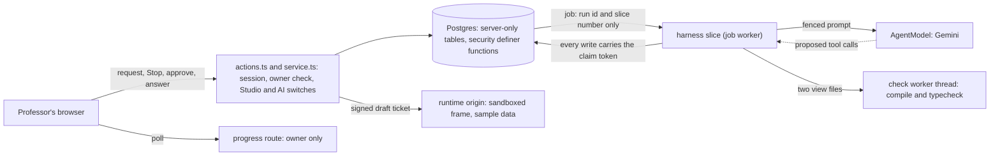

# Studio Builder: the Agent Harness

A professor describes a teaching tool, and Athena builds it. This document is how that works: what the model may do, what Scholera decides, what is stored, and why a build can't reach students on its own. Rule numbers cite [studio-plugin-rules.md](./studio-plugin-rules.md), which wins any disagreement. The working design this came from is `docs/designs/studio/studio-agent-harness.md` (local, gitignored).

| | |
|---|---|
| **Status** | Step 7D: accepted locally on PostgreSQL 17 with real PostgREST and a production build; real Supabase, the live Cloud Run service and staging are still pending (see [Verification](#verification)). Steps 8B to 8D add project memory, verified on the same local stack and accepted in a browser walkthrough |
| **Owner** | Kevin Dohsi |
| **Date** | 2026-10-02 |
| **Migrations** | `supabase/migrations/20261002160000_studio_builder.sql`; for project memory `supabase/migrations/20261002210000_studio_project_memory.sql` and `supabase/migrations/20261002230000_studio_memory_slots.sql` |
| **Code** | `src/lib/studio/builder/`, the builder section of `src/lib/studio/db.ts`, `builderActor` in `src/lib/studio/context.ts`, `publishDraft` in `src/lib/studio/lifecycle.ts`, the draft frame in `src/lib/studio/runtime/frame{,-ticket}.ts`, the builder UI in `src/components/studio/builder/` |
| **Endpoints** | `src/app/(dashboard)/professor/courses/[sectionId]/studio/actions.ts`, `GET /api/studio/builder/runs/[runId]`, `GET /studio-frame/v1/draft/[projectId]/[view]` (runtime origin only) |

## The one rule

The model proposes. Scholera decides which actions exist, validates every argument, runs every effect, and ends every run. Nothing the model writes, including text that looks like an instruction, can change that, because no tool exists for anything outside the list below.

The furthest a build can go on its own is `preview_ready`: a new draft the professor can preview on sample data. Saving it as a version is a separate professor click. Installing, activating and showing it to students are the Step 5 actions in [studio-plugin-publication.md](./studio-plugin-publication.md), which no builder code imports.

## Trust boundary

Dotted arrows carry model output. Each ends at code that validates it.

| Input | Why it is untrusted | How it is contained |
|---|---|---|
| The professor's request and answers | Free text | At most 4000 characters, control and bidi characters refused, never logged |
| Model tool calls | The model can be wrong or steered | Only eleven tools exist. Each argument is a flat strict schema; paths are a two-value enum; no argument names an id or scope |
| Generated code | It may be broken, insecure or written to exfiltrate | Scholera compiles it, typechecks it against a hand-written environment, runs Stage 1, and it only ever runs in the Step 4 sandbox |
| Generated manifest | It is the plugin's whole escalation surface | Parsed, owned fields stamped, diffed and classified; escalations wait for the professor |
| Course labels and skill names | Skill names can come from uploaded files | Entered as fenced data with provenance `course-data`, below the professor in the authority order. Never accepted as the evidence for a saved decision |
| Saved project decisions | Approved by the professor, but the model worded most of them | Fenced as data with provenance `project-memory`, below the current request. The model can only propose; the professor approves that exact row |
| Course material | Uploaded files and professor-written text, some not yet visible to students | Reached only through `search_course_material`, read again from Postgres every turn, fenced with provenance `course-material`, below the request. Never evidence for a saved decision. A copy guard keeps unreleased wording out of the tool (see [Course material](#course-material)) |

## What is stored

Five server-only tables (the fifth, `studio_plugin_memories`, came with Step 8B): RLS on with no policies, every client grant revoked, `service_role` only. Only `db.ts` names them (`studio-table-access.test.ts`).

| Table | One row is | Notes |
|---|---|---|
| `studio_plugin_snapshots` | One immutable draft state, keyed by `(project_id, hash)` | Refuses UPDATE. Holds the stamped manifest, the two view sources, both compiled bundles and the check summary |
| `studio_plugin_builder_runs` | One build: one professor message | Lifecycle, the private working copy (`work`), plan, approval card, questions, counters and cost, the claim token, the result |
| `studio_plugin_builder_steps` | One observable action | Append-only. Unique on `(run_id, seq)` and `(run_id, tool_call_id)` |
| `studio_plugin_builder_spend` | The cost of one model call | Append-only. The school's daily cap sums it (see [Budgets](#budgets-the-kill-switch-and-entitlement)) |
| `studio_plugin_memories` | One saved decision, or one proposal waiting for the professor | Project-scoped, with a topic and a slot. Status `proposed`, `active`, `superseded`, `removed` or `rejected`. Words, slot and scope never change; see [Project memory](#project-memory) |

Changes to Step 1 tables: `studio_plugin_projects.draft` (never used) is replaced by `draft_head_hash`, `draft_rev` and `draft_undo_hash`, each hash with a composite key to the project's own snapshots. `studio_plugin_versions` gains `source_snapshot_hash`, unique per project, so every saved version names the draft it came from and the same draft can't be saved twice.

There is no conversations or messages table. A project's conversation is its runs in order: each run's `request` and its result's `summary`. Professor answers live in the run's `questions`.

Never stored: hidden reasoning, prompts, provider responses, file content in steps, plan text in steps, student names. Step summaries hold paths, byte counts, 16-character content hashes, enum values and reason codes.

## Snapshots and the draft pointer

A snapshot's hash is the SHA-256 of the canonical JSON (keys sorted at every level) of `{format: 'studio-draft-v1', compiler, manifest, files}`. The compiler id (`studio-tsx-v1+ts<version>`) is part of it, so a TypeScript upgrade can't reuse stored bundles. Timestamps, run ids and check results are not part of it, so identical content always has the same hash.

A build:

1. starts from the project's current snapshot (its `base_hash` and `base_rev`);
2. edits a private copy in `runs.work`, which nothing outside the run can see;
3. on a successful finish only, writes one snapshot and moves the pointer in `studio_builder_end`.

That function locks the project row (the same lock a publish takes), requires `draft_rev` to still equal the run's `base_rev`, inserts the snapshot, then moves the pointer, records the old head in `draft_undo_hash` and increments the revision. If the draft moved during the run, the run ends `blocked` with `draft_changed` and nothing is overwritten. Stop, failures, budget limits and validation failures save nothing.

Every function that takes both locks takes the project row first, then the run row: `studio_builder_start`, `studio_builder_undo` and the commit in `studio_builder_end`. A start racing a commit waits instead of deadlocking. A real-Postgres test holds the project lock and checks the run row is still free.

### Undo and draft history

Undo moves the pointer back one step, to the snapshot that was the draft before the last successful build. `studio_builder_undo` takes the expected head and revision, locks the project row and answers:

| Outcome | When |
|---|---|
| `undone` | The pointer moved: head becomes the undo target, the target is cleared, the revision goes up by one |
| `busy` | Any run of the project is queued, running or waiting. Undo never moves the draft behind an active run; stop it first |
| `draft_changed` | The expected head or revision is stale |
| `unavailable` | There is no undo target: the first build, or an undo already used |
| `not_owner`, `archived` | The project isn't the professor's, or is archived |

It is one step on purpose. After an undo there is nothing to redo or undo until the next successful build. Nothing is deleted: snapshots stay, saved versions are untouched, and the newer draft stays in the history list. The server action audits each undo with `logEvent` (project, short from and to hashes).

The draft history (`listDraftHistory`, owner only) lists up to 20 snapshots the project's builds made, newest first. Each entry has its time, the run that made it, the professor's own request cut to 120 characters, and markers for the current draft, the undo target and a saved version. It never holds model text (plan, note, questions), source, manifests or check details beyond pass or fail.

Published versions stay what they were: immutable release artifacts. A snapshot is development history; a version is what an installation runs.

## Run states

The database enforces the state machine with a trigger (`studio_builder_runs_transition`). A finished run never changes again, except that late spend still adds to its cost.

| Status | Kind | Meaning |
|---|---|---|
| `queued` | active | Waiting for a worker to claim the next slice |
| `running` | active | A slice holds the run (it has the claim token) |
| `waiting_for_approval` | active | Paused on a manifest approval card. No job, no claim |
| `waiting_for_professor` | active | Paused on a question. The professor's answer resumes the same run |
| `preview_ready` | terminal | The completion gate passed and a new snapshot is the draft |
| `completed` | terminal | The gate passed, but nothing differed from the starting draft |
| `blocked` | terminal | The model gave up (`agent_blocked`), checks never passed (`repair_rounds`, `same_finding`, `check_runs`), the draft moved (`draft_changed`), or a gate refused mid-run (`studio_paused`, `not_entitled`, `ai_disabled`, `access_lost`, `project_archived`) |
| `cancelled` | terminal | Stop, an expired card or question (`expired`), or replaced on the professor's confirmation (`superseded`) |
| `budget_exhausted` | terminal | A run budget ran out (`limit_*`) |
| `failed` | terminal | Repeated malformed or refused calls, the model unavailable, a check timeout, too many interruptions, or a harness fault |

Allowed moves: `queued` to `running`, `cancelled` or `failed`; `running` to any status; either waiting state to `queued` or `cancelled`. Phases (`understanding`, `planning`, `editing`, `checking`, `repairing`) only drive progress copy.

One active run per project, by a partial unique index. A new request while a run is queued or running is refused with the running run's id. A new request while a run is waiting for the professor returns a conflict; only a second request that names the waiting run (`replaceRunId`, sent after the professor confirms "Replace it") cancels it as `superseded`, and its trajectory stays.

## Where a build runs

Each build runs as checkpointed slices on the existing `background_jobs` queue (job type `studio_builder_slice`, params `{runId, sliceNo}`, no section, so a TA who can read section jobs reads nothing). With no section, the existing `background_jobs` policy lets the school's admins read the row: the run id, who started it, timestamps, and a fixed word for how the slice ended. That matches what they already see of institution-level jobs, and the run id opens nothing because the progress route is owner-only. Accepted as is. A slice:

1. claims the run with `studio_builder_claim`, which writes a fresh claim token;
2. heartbeats every 5 seconds; a lost claim or a Stop aborts the model call in flight;
3. runs turns while it has time, persisting every step as it goes;
4. hands off to a new slice (`studio_builder_handoff`), pauses, or ends.

Nothing that steers the run lives only in memory. A crashed instance costs at most one re-asked model turn: the next claim marks any calls the interrupted turn proposed but never recorded as `interrupted`, and rebuilds context from the database. A slice silent for 60 seconds can be re-claimed, at most twice (`failed`, `interrupted` after that). Two paths requeue a stalled run, through the same database body (`studio_builder_tend_run` in `20261002200000_studio_builder_upkeep.sql`): the owner's progress read (`studio_builder_tend`), and the job worker's sweep (`studio_builder_sweep`), which every kick runs after the reaper and before its drain, so the drain claims the slices it requeues. A run counts as stalled when its job is gone, done or failed, or, while running, when its heartbeat is 60 seconds old. A queued run whose job is still pending is not stalled. The sweep also expires unanswered cards and questions, tends at most 50 runs per kick (`STUDIO_BUILDER_SWEEP_LIMIT`), oldest first, and skips a run whose row another transaction holds.

Every write a slice makes carries its claim token. Once another slice holds the run, every write from the old one is refused; only its model spend still reaches the run's cost.

### Cloud Run and CPU

What the repo sets (`infra/app/deploy-to-prod.sh`, `deploy-to-staging.sh`, `setup-sweep-schedulers.sh`): a 900-second request timeout, 4 GiB and 2 vCPU, 0 to 10 instances in production (0 to 2 on staging), and a Cloud Scheduler sweep every 5 minutes with a 600-second attempt deadline. Neither CPU flag is passed, so the service runs on Cloud Run's default, request-based CPU: an instance has CPU only while it is processing a request. Whether anyone changed that by hand can only be read from the live service (`gcloud run services describe scholera --region us-central1 --format=export`, field `run.googleapis.com/cpu-throttling`).

So nothing in a build runs on CPU that outlives a request:

- Every kick is awaited by its caller (`kickWorker`), so the request leaves while the caller's own request still has CPU. It is abandoned after 2 seconds. The drain it starts is its own request to the service, with its own CPU, until it answers or reaches the 900-second timeout. Google documents that a client disconnect isn't passed to the container. That the drain keeps its CPU after the client has gone is an inference from the request-based billing docs, to confirm once on staging with a build longer than 5 minutes.
- A slice is capped at 480 seconds (`STUDIO_BUILDER_SLICE_MAX_MS`), and no model turn starts in its last 270 seconds, so it ends well inside the drain's 900 seconds.
- If an instance stalls or dies mid-slice, correctness holds: the claim token fences the stalled slice out. The next kick, or the 5-minute Cloud Scheduler sweep at the latest, requeues a run whose heartbeat is 60 seconds old or whose job the reaper failed, at most twice, then fails it as `interrupted` and frees its live slot. With the page open, the professor's progress read does the same sooner.

Step 7B kicked with a `hold` option that left the request open instead of awaiting it. Under request-based CPU that request might never be sent once the caller had answered, and Node's fetch gives up after 300 seconds without response headers anyway. The option is gone.

If staging shows slices stalling, the next step is a Cloud Tasks kick (a dispatch deadline up to 30 minutes, task creation awaited inside the request). `--no-cpu-throttling` is the last resort, because it bills every 4 GiB instance for its whole life. Slices don't change under either.

Shared worker changes, all additive: the drain's deadline reaches pipelines as `ctx.deadline`; a pipeline can declare `minBudgetMs` and a drain with less time left doesn't claim that type; a worker only writes completion for a job it still holds (`claimed_by`); `kickWorker` is exported. Existing pipelines behave as before (`jobs-worker.test.ts`).

Staging gets the builder's settings from `deploy-to-staging.sh`: the jobs and frame-ticket secrets from Secret Manager (created with a generated value the first time, never rotated by a deploy), the kick URL from `SITE_URL`, and `STUDIO_RUNTIME_ORIGIN` from the staging env file, checked before anything deploys. Its sweep job is `jobs-worker-sweep-staging`, created with `setup-sweep-schedulers.sh --staging`. `infra/app/README.md` lists each setting, where it comes from, and what happens when it is missing. Every missing setting makes the builder refuse, or end the run with a fixed reason (`studio-builder-config.test.ts`).

## The tools

The model sees the same eleven tools every turn. There is no shell, filesystem, network, database, publication, activation, visibility, entitlement or binding tool.

| Tool | Does | Limits |
|---|---|---|
| `read_file` | Shows one view in the next turn | Path is `views/student.tsx` or `views/professor.tsx`, nothing else |
| `get_kit_reference` | Shows one kit component's props and usage | Enum of the importable kit names |
| `write_file` | Replaces a whole view in the working copy | 32 KiB; well-formed text with no NUL, controls or bidi characters |
| `edit_file` | Replaces exactly one occurrence of `old_text` | Only in a view the model has read |
| `propose_manifest_change` | The only path to the manifest (below) | 32 KiB of JSON |
| `run_checks` | Compile, typecheck, Stage 1, builder checks | The model can't choose or skip checks. Unchanged work returns the cached result |
| `submit_plan` | Records goal, files, manifest changes, checks | Plain text, at most 8 KiB. A plan grants nothing |
| `ask_professor` | Pauses for one answer | At most 2 per run |
| `search_course_material` | Searches this course's own material; the excerpts arrive next turn as data | 1 to 4 keywords, at most 200 bytes; time only through `focus` (`this_week`, `next_week`, `week:N`); 3 searches per run, 6 excerpts each (see [Course material](#course-material)) |
| `propose_memory` | Suggests one lasting decision for the professor to keep | Topic and slot from closed lists; at most 2 per run; needs a quote of the professor's own words; inert until the professor approves it (see [Project memory](#project-memory)) |
| `finish` | Asks to end: `completed` or `blocked` with a summary | `completed` triggers the harness's own gate |

Refusals use one vocabulary (`RefusalCode` in `tools.ts`), each with a fixed hint for the next turn. A plan is required before any manifest change, before writing on a first build, and before changing both views; on a first build the manifest must exist before any view is written.

Calls in a turn run in the order proposed, except `run_checks` runs after the turn's writes and `finish` or `ask_professor` runs last. At most 8 calls per turn; the rest are refused together as one error.

## The manifest and approval

`propose_manifest_change` parses the JSON, refuses control and bidi characters anywhere, and stamps what Scholera owns (`manifestVersion` 2, `id` from the project slug, `version` `0.0.0`, `bridgeVersion` `v1`, both view entries). It then validates with `parseManifest`, refuses capabilities without a Bridge method (today `course.weakSpots`), refuses changes to collections a published version declared, and screens the wording with `deterministicPurpose`.

It then diffs the proposal against the working copy and classifies every change:

| Needs the professor's approval | Applies directly, listed on the result |
|---|---|
| A capability added to a view (counted per view) | Name, description, purpose summary, skill slot labels |
| A signal added | Removing a capability, signal, skill slot or unpublished collection |
| A collection added | Field changes on an unpublished collection |
| Any access change on an unpublished collection | The AI fallback |
| A skill slot added | |
| A purpose category or audience change (so a first build always asks once) | |

An approval card is bound to exactly one proposal: a fresh `proposal_id`, the `delta_hash` of `(base revision, base manifest, proposed manifest)`, and the working copy's revision. `studio_builder_decide` checks all three, the 72-hour expiry, and that no decision exists yet (the decision is a step keyed `approval:<proposal_id>`). Approving needs room under the school's live-run cap. A replayed or stale decision is refused, and a re-proposed change gets a new card. Card lines come only from fixed tables and checked keys, never from the model's words. Athena's plan is not shown on the card.

Approving a card lets the build continue. It is not the rule 8.2 approval, which still happens at install and activation.

## Checks and repair

The draft gate (`checks.ts`), in a fixed order:

1. Compile both views (the check worker). The compiler accepts named imports from `react` and `@scholera/plugin-kit` only, one named default export, and never the reserved `ScholeraKit` name. It emits the canonical classic-script bundle and checks it parses with no module syntax.
2. Typecheck both views against `kit/plugin-kit-types.ts` alone (`noLib`, `strict`, `noUnusedLocals`). There is no DOM, Node or Scholera type to reach.
3. Stage 1 static checks from the validator, on the artifact a Save would publish, minus `artifact.hash` (always matches) and `edtech.purpose` (the AI classifier runs at Save, never in the loop). A `needs_review` outcome blocks.
4. Builder checks: the manifest is valid, available and compatible; the purpose wording passes `deterministicPurpose`; and no student's full name (across every section the owner teaches) appears in code or manifest. The roster check fails closed when the roster can't be read, and never quotes the name.
5. `builder.disclosure`: the tool's visible text doesn't copy course material students can't see yet (see [Course material](#course-material)). It fails closed when that material can't be read.

Stage 2 (the browser) never runs in the loop. It stays with publication.

The check worker is a worker thread started from a generated string (`check-worker.generated.ts`, built by `scripts/studio/build-check-worker.mjs`; a test fails if it is stale). It gets none of the server's environment, arguments or Node flags, is capped at 512 MB of heap and 10 seconds per call, and is terminated and replaced on a timeout or crash. The run then ends `failed` (`check_timeout`) and saves nothing. The worker suite passes on Node 22.23.3, the major version the `node:22-slim` image runs.

Findings return to the model as bounded data: at most 40, ordered required-first and by severity, each with a fixed hint, inside a fenced `check-output` block.

Repair is bounded:

- 3 repair rounds;
- 6 check runs;
- a blocking finding (check and file) that survives 2 repairs ends the run (`same_finding`).

`finish(completed)` never trusts the model. The harness re-checks the plan requirement and re-runs the gate if anything changed since the last check. A failing gate counts as a repair round. Only a passing gate saves a snapshot, and the bundles saved are the trusted compiler's output for exactly those files.

## Context

Every turn rebuilds the prompt from durable state (`context-builder.ts`, pure). The stable instructions (`instructions.ts`, versioned `studio-builder-l1-v5`) are the same bytes on every turn and hold no project data. The prompt holds, from least to most volatile:

1. The manifest's structure, unfenced, and its own words, fenced.
2. The file map, frozen collections and available capabilities.
3. The last 3 builds of the project.
4. The project's saved decisions, picked deterministically (see [Project memory](#project-memory)).
5. The course code and title, plus skill names only when the request is about skills.
6. The course material the model's searches found, re-read for this turn.
7. The kit references the model asked for.
8. The files it has read, with line numbers.
9. The latest findings.
10. The action log and refusal hints, the plan, and the remaining budgets.
11. Last, the professor's request and answers.

Everything not written by Scholera or the professor sits inside a `<data_NONCE>` block with a provenance attribute (`plugin-code`, `check-output`, `course-data`, `course-material`, `earlier-request`, `model-authored`, `project-memory`). The nonce changes per prompt, and text inside a block can't close it (`fenceBlock` in `prompt-fence.ts`).

The authority order, stated in the instructions and enforced by what tools exist, is:

1. platform rules, including the tool schemas and policies, the validator and each tool's refusals;
2. the current system and code facts: the tool's manifest, files and frozen collections;
3. the professor's request in this build, and their answers;
4. saved project decisions, which the professor approved or typed;
5. earlier builds and check findings;
6. anything the model inferred.

A saved decision never outranks the request in front of the model, and never outranks a platform rule.

No id (tenant, section, user, project, run, memory), student data, secret or URL ever enters a prompt. Course material enters only as the fenced excerpts below, with student names redacted. The prompt is held to 64,000 estimated tokens by fixed trims, in order: memory preferences, course material (all but the newest search), history, skills, the action log, kit references, findings.

## Course material

Step 9 lets the builder read the course it is building for (`course-material.ts`, pure; `course-retriever.ts`; the `studio_course_*` functions in `20261003003000_studio_course_context.sql`). Pinecone stays a future provider behind the `CourseRetriever` interface; version 1 is PostgreSQL full-text search.

**What it can read.** One SQL function, `studio_course_units`, decides eligibility for every read: module items, modules, assignments and the syllabus of the run's own section and institution. Each unit has a disclosure class:

- `released`: students can see it now;
- `scheduled`: published, with an unlock date still ahead (the builder may read it, decision D9-1);
- `withheld`: hidden or unpublished. Never shown; a search reports only how many matched, so the model can tell the professor to publish them with a date or paste the material.

**Searching.** `search_course_material` takes 1 to 4 keywords and an optional `focus`. Time words are stripped from the query; time goes through `focus`. "This week" ranks modules dated within 7 days of now 1.5 times higher (D9-3), and falls back to the course start date and week numbers only when modules have no dates. Ranking is `ts_rank_cd` over an OR of the query's lexemes, at most 2,000 units per section, and excerpts come from `ts_headline` with no markup. A search returns at most 6 excerpts of 1,200 bytes, labelled with their source ("Week 6: Attention (lecture), page 12") and, when not yet visible, "not visible to students yet, opens Oct 9". A search or re-read that takes longer than 3 seconds, or fails, is reported to the model as unavailable and the build carries on without it.

**Every turn re-reads.** Excerpts aren't stored in the prompt history. Each turn reads the found units again, so material hidden or deleted mid-run drops out, and material that changed class is relabelled; a unit that became unopened is added to the run's provenance (`material.reclassified`). The block is held to 12 KiB, dropping the oldest whole search first.

**Provenance.** The run keeps the key of every unopened unit it read, with the section it was built in (`material_sources`, `{k, s}`). At commit `studio_builder_end` unions them into the project's and prunes: a source students can now see, or that no longer exists, can't leak and is dropped; of the rest the newest 96 stay, and `material_incomplete` is set when any had to go. Save copies both onto the version. The professor sees "Athena read these from your course:" on the ending card, unopened material first, with when students can see it. The release review reads the version's provenance again as it is now and warns `unreleased_material` before Show or a version switch ([studio-plugin-publication.md](./studio-plugin-publication.md)).

**The copy guard** (`disclosure.ts`, check `builder.disclosure`). The model may use unopened material for structure and topics, never its wording. The gate compares the tool's visible text (string literals and JSX text in each view, parsed with the TypeScript parser, as one word stream per view, plus the manifest's words) against the current text of every unopened source in the provenance. Two shared 5-word shingles fail the draft; a short source of 4 to 9 words fails when it appears whole. It runs again at Save. It fails closed when the material can't be read, and names a source the owner no longer teaches only generically.

**Roster names** in material are redacted before the model sees them, matched after NFKD folding, with curly apostrophes and Unicode dashes made plain, invisible characters removed, and "Last, First" order recognized.

## Project memory

Steps 8B to 8D. A project remembers the professor's lasting decisions about one tool, such as "keep the student view extremely simple", so the next build respects them without being told again. It is small on purpose: one table, project scope only, no embeddings, no vector store and no summary of past conversations.

### What is remembered, and what is not

| Kind of information | Where it lives | Remembered as memory? |
|---|---|---|
| A professor's decision about this tool | `studio_plugin_memories` | Yes. The only thing stored as memory |
| The last 3 builds: request, outcome, the model's summary | `studio_plugin_builder_runs` | No. Read each turn as "earlier builds" (data) |
| A past check failure, a file the model replaced | `studio_plugin_builder_steps` and runs | No. Derived on read, so it can't go stale |
| A professor preference across all their tools, a course-wide rule, anything about students | nowhere | Not built. Memory never crosses a project |
| What the model guessed the professor wants | nowhere | Never. A guess has no row to live in |

### Scope

A decision belongs to one project, and through it to one professor and one institution. A project is installable in many sections, so a decision is deliberately not tied to a course. The model reads decisions for the run's own project only: the project and institution come from the run row, never from a tool argument. An archived project loads none. Deleting a project deletes its decisions; deleting a run only clears the link on the proposals it raised.

### Topics and slots

A decision has a topic and a slot, both from closed lists (`MEMORY_SLOTS` in `memory.ts`; the database's `studio_plugin_memories_slot_check` lists the same pairs, and a unit test keeps the two in step). A slot names one independent decision within a topic, so "no AI" and "reviews stay anonymous" are both `content_policy` but live in different slots and never replace each other.

| Topic | Slots |
|---|---|
| `student_ui` | `general`, `complexity`, `layout`, `interaction`, `feedback` |
| `professor_ui` | `general`, `layout`, `analytics`, `workflow` |
| `content_policy` | `general`, `ai_usage`, `anonymity`, `answer_visibility`, `grading`, `tone` |
| `accessibility` | `general`, `motion`, `contrast`, `keyboard`, `readability`, `target_size` |
| `data_collection` | `general`, `tracking`, `retention`, `identity`, `free_text` |
| `terminology` | `general`, `naming`, `reading_level` |
| `other` | `general` |

Thirty slots in all, so the cap of 20 active decisions per project is reachable. A project keeps at most one active decision per (topic, slot); a partial unique index enforces it. The model can't invent a slot: the tool's schema lists the slot names, the harness refuses a slot that isn't one of the topic's, and so does the database. Professors see the pair in words, such as "Content and AI rules: Use of AI", never the enum names.

`general` holds a decision that fits no narrower slot, and every decision made before slots existed: the migration `20261002230000_studio_memory_slots.sql` moved every row to its topic's `general` slot, keeping ids, statuses, history and timestamps.

Two kinds: `constraint` ("Every build" to a professor) and `preference` ("When relevant").

### How a decision gets saved

Only two things write memory, and neither is the model.

1. **The professor types it** in the "Studio remembers" panel (add, edit, remove; "About" picks the topic and "Which part" the slot). An edit is a new row that supersedes the old one, so history is never rewritten. Saving into a part that already holds a decision replaces it; the panel says what before the professor saves, and the button reads Replace.
2. **The professor approves a suggestion.** The model can call `propose_memory`. The call records an inert `proposed` row and nothing else. The professor then sees "Remember for this tool?" on the build's ending card, with the category, the sentence, their own quoted words, and everything approving would replace. Remember activates that exact row; Not now rejects it. An answered suggestion stays on the card, in place, with focus on its "Saved." or "Skipped." line. A suggestion nobody answers can't be approved after 72 hours, and the builder's upkeep rejects it. Active decisions never expire.

Every model-originated decision needs that approval, including ones that sound final ("always", "never").

`propose_memory` takes a topic, a slot, a kind, one sentence, a quote and an optional label to replace. The checks:

- **The quote must be the professor's own words from this run** (harness and database). It is an exact substring of this run's request or of an answer the professor gave in it, 4 to 200 characters. The model's own text, plugin code, check output, course titles, skill names, an earlier build's summary, an earlier request and the saved decisions in the prompt are never consulted, so none of them can be the evidence. This is the main defense against a malicious course document, a poisoned skill name or a stored injection becoming a lasting instruction.
- **The quote must support the sentence** (harness). They share a content word; "to" or "no" doesn't count.
- **The quote can't start just after a negation** (harness). "answers to students" cut out of "Don't show answers to students" is refused; the quote has to carry the "Don't".
- **The sentence must describe the tool** (harness, and the panel for the professor's own typing). At most 200 characters, one line, no markup, no control or bidi characters, and nothing that talks to the builder (switching off checks, naming tools, the validator, publishing or installing the tool, "ignore previous instructions"). A false positive only asks for a rewording.
- **The slot is one of the topic's** (harness and database).
- At most 2 proposals per run; no duplicate of an active decision; a project can't pass 20 active decisions (harness, database function and a trigger).
- **`replaces` is a label** such as `m1` that the prompt showed this turn. The harness maps it to a row of this project, or refuses it. It may name the active decision in the proposal's own topic and slot, or the topic's `general` decision, never one in another specific slot (harness, database function and the insert guard). No id is ever accepted or shown.

The write goes through `studio_memory_propose`, behind the same claim-token fence as every other run write, so a stale slice or a stopped run records nothing.

### Supersession

Approving a decision supersedes, in the same transaction, the active decision in its own topic and slot and the one it named (which can only be in that slot or the topic's `general` one), so the old and the new are never both active. Nothing else on the topic changes: changing the decision about AI use leaves the one about anonymity alone. Approvals and panel saves for one project take the same per-project lock, so two of them racing for one slot end with exactly one active. The card lists every statement approval would supersede, so nothing is replaced silently.

### What the model reads

The context builder picks decisions deterministically (`selectMemories` and `relevance` in `memory.ts`). A decision's relevance to a turn is: 2 for each topic word in the professor's request and answers, 3 for each word of its slot, 1 for each word it shares with the request, and 1 when the build may touch the decision's view.

- Tier A: active constraints, the most relevant first (oldest first on a tie), up to 6. Any constraint is sent while there is room.
- Tier B: preferences with a relevance above zero, best first (the most recently decided first on a tie), up to 4. A decision about a view reaches any build that may change that view, even if the request never names it.
- At most 8 in all and 2 KiB of text. Preferences give way before constraints, under the byte cap and under the prompt's token limit, where they are the first trim.

They appear as one fenced block with provenance `project-memory`, after the earlier builds and before the course, one line each: `m1 constraint (content_policy/ai_usage): Do not use AI.`, with a short preamble outside the fence. The request is the last thing in the prompt.

### Authority and conflicts

From highest to lowest: the platform rules (including the tool schemas, tool policies, validator rules and each tool's refusals); the current system and code facts (the tool's manifest, files and frozen collections); the professor's request in this build and their answers; saved decisions; earlier builds and findings; anything the model inferred. A saved decision is data. It can't relax a platform rule, a check or a limit, and it yields to the current request.

When a request conflicts with a decision, the model follows the request and proposes a replacement in the same slot (or names the topic's general decision). The old decision stays active until the professor approves the new one. A request that touches one slot leaves the others standing: "Add AI-generated hints but keep reviews anonymous" replaces only the AI decision.

### Failure and visibility

A failed memory read is logged (the error's name, never its message) and the build goes on without memory. Platform rules never depend on memory. After a build the card says "Applied N saved decisions", which counts what the last prompt carried and doesn't claim they changed the output. The panel lists only active decisions: no proposals, no superseded or rejected rows, nothing the model worked out for itself.

### Acceptance (Step 8D)

On the production standalone build against the local stand-in, with no model key on the server and the school's builder switch off, a Playwright walkthrough passed 50 of 50 checks. It covered:

- add, edit and remove;
- a suggestion's Remember and Not now;
- a replacement that names exactly what it replaces and leaves the neighbouring slot active;
- a conflict that leaves the stored decision unchanged until approval;
- superseded, removed and rejected decisions staying out of later prompts;
- project isolation;
- axe checks with no violations, keyboard order, focus after a decision, 44 px targets, and phone width.

A probe ran the real harness with a scripted model against the same database to read what a later build's prompt carried. No real model turn happened.

The live eval has five memory cases (M1 to M5 in `eval/studio-builder/cases.ts`). They record only check names and booleans.

## Budgets, the kill switch and entitlement

Named settings in the builder section of `src/lib/studio/limits.ts`; the database functions take them as arguments.

| Scope | Limit |
|---|---|
| Per run | 24 model turns, 48 tool calls, 30 writes, 256 KiB written, 20 minutes of active time, $2.50 |
| Per professor | 15 builds in any 24 hours |
| Per school | 3 builds queued or running at once, $100 of builder spend in any 24 hours |

Before every model call the harness checks, fresh:

- the run is running, this slice holds it, and nobody pressed Stop;
- the professor still has the section as its professor, and the project is active and theirs (`builderActor`, a brand not assignable to `StudioProfessor`);
- Studio is on and the school has the `studio` entitlement (`studioAccess`);
- the `studio-builder` AI switch is on (a new group in `ai-features.ts`);
- the school's 24-hour builder spend leaves room for one more call;
- every run budget, including the run's spend plus a worst-case next call ($0.42 at Pro rates).

Turning the AI switch off stops every build at its next model call.

Spend is recorded in three places, for different jobs:

- The usage ledger row (`recordAiUsage`, feature `studio_builder`, the run id in metadata) is what the provider reported.
- `studio_builder_add_cost` runs the moment a reply lands, before anything else. It adds to the run's counter, which the per-run cap reads, and writes a `studio_plugin_builder_spend` row, which the school's daily cap sums by when it was spent. It runs whatever state the run is in, so a reply that lands after Stop, after a lost claim or after the run ended still counts.
- The model-turn step carries the same cost, for the trajectory only.

A call whose usage never comes back (a timeout, or a call cut off by Stop or a lost claim) is charged to both caps at the worst case for one call ($0.42 at Pro rates), since the provider may still bill it. The ledger keeps what the provider reported.

Token semantics are the shared ledger's (`TokenUsage` in `src/lib/ai/cost.ts`), fixed platform-wide in Step 7C. In AI SDK v6, `outputTokens` already includes reasoning tokens (`@ai-sdk/google` adds `thoughtsTokenCount` into it), so cost bills `outputTokens` at the output rate, and `reasoningTokens` is only the thinking share, never added again. Before the fix every thinking call was billed for its reasoning twice. The tool-loop surfaces (Athena's turn, the professor and assignment assistants) now record `totalUsage`, all steps, instead of the final step only. Rows written before the fix keep their stored cost; the dashboard sums stored cost and never recomputes it.

## Stop

Stop marks the run, and nothing else changes for the professor: their saved draft is untouched.

| Run state when Stop arrives | Effect |
|---|---|
| Queued, or waiting for the professor | Cancelled at once |
| Running, but its slice is dead (stale heartbeat, or its job finished) | Cancelled at once |
| Running, live | A durable flag. The heartbeat aborts the model call; every gate and every write refuses; the slice ends the run `cancelled` |

A commit that arrives after Stop also ends `cancelled`. The working copy is discarded and the draft pointer doesn't move. The run row, its steps, cost and timestamps stay.

## Idempotency

| Operation | Why a retry can't repeat it |
|---|---|
| A tool step | Unique `(run_id, tool_call_id)`; ids are generated by the harness (`<turn seq>.<index>`) |
| A working-copy write | The write names the revision it expects |
| A model turn | Not re-asked once recorded; before that, re-asked by design |
| A snapshot | `on conflict (project_id, hash) do nothing` |
| A commit | The run must be running with this token, and the draft at the run's base revision |
| A start | Unique `(owner_id, client_request_id)` |
| An approval or answer | Single-use step keys |
| A saved version | Unique `(project_id, source_snapshot_hash)` |

## Draft preview

`issueDraftPreview` (owner only) returns a frame URL for one view of one of the professor's own snapshots, plus the Bridge methods its manifest allows. The ticket is an HMAC over `{kind: 'draft', project, hash, view, expiry}` with a key derived just for drafts, so neither an installation ticket nor a draft ticket verifies as the other. The draft frame route checks the host, the ticket, the path and the Studio kill switch, loads the bundle by project and hash, and serves the same Step 4 document and headers. Every failure is the same 404.

The frame runs in `PluginHost` preview mode, on the in-memory preview bridge with sample records. It never reaches `/api/studio/bridge`, real records, publication or students.

## Save as version

`publishDraft` is the professor's "Save as version". It requires:

1. the professor owns the project;
2. Studio is on and the school has the entitlement;
3. the exact snapshot is still the draft;
4. it isn't already saved;
5. its stored content still hashes to its hash under the current compiler.

It re-runs the whole draft gate and rebuilds both bundles with the trusted compiler. Then it publishes through the same internal path as `publishVersion`, with the next version number (a minor bump, or 1.0.0) and `source_snapshot_hash`. Stage 1, with the real purpose classifier, runs on the new version as for any publish. Nothing is installed, activated or shown.

## Security invariants

Each has a test, and the starred ones also have a mutation test that removes the guarantee and confirms a test fails:

- No tool can name a file other than the two views, or any id (`studio-builder-units.test.ts`). ★ path allowlist
- The manifest can't be written as a file (the path enum), and changes that need approval never apply without one (harness tests). ★ approval requirement
- A model can't call a tool that doesn't exist, including any publication tool (harness tests, and an import-boundary test that builder modules never import publication, installation, record or binding code).
- Budgets and the kill switch are checked before every model call. ★ budget check
- Stop is observed during a model call. ★ cancellation
- A stale slice writes nothing (harness and database tests).
- The draft pointer never overwrites newer work. ★ CAS (database and harness)
- A decision can't be replayed onto another card (database and harness tests).
- Another professor, a TA or no session gets the same refusal from every entry point, and nothing from the progress read. ★ owner checks
- `finish` saves only what the harness's own gate passed. ★ final check
- The builder actor is not a `StudioProfessor` (a type-level test).
- Builder content (requests, source, trajectory, approvals, cost) has no client grant (database test).
- Memory is project-scoped: a read pins the run's project and institution, a row can't name another project's run or decision, and another institution gets nothing (database tests). ★ project scoping, ★ institution guard
- A suggestion is inert until the professor approves that exact row, bound to its run and owner; the model has no path to an active decision (database and harness tests). ★ professor approval
- A suggestion's evidence is an exact quote of the professor's own words in the current run, checked in the harness and again in the database; course text, skill names, code, findings and earlier summaries can never be evidence. ★ evidence check
- A project has one active decision per topic, a decision's words never change, and approving supersedes the old one in the same transaction. ★ topic uniqueness
- A project can't pass its active cap, a run can't pass its proposal cap, and a prompt carries at most 8 decisions and 2 KiB of them. ★ memory caps
- The current request outranks a saved decision, in the instructions, in the prompt, and by position. ★ request overrides memory
- A failed memory read never fails a build, and a stale or stopped slice records no proposal (harness and database tests).
- Course material is read only through `studio_course_units`, pinned to the run's institution and section; hidden and unpublished material never reaches a prompt (database tests, `db/studio-course-context.test.ts`). ★ eligibility
- A draft that copies unopened wording into the tool fails the gate and Save, and an unreadable source fails closed (`studio-course-material.test.ts`, harness tests). ★ copy guard

## Evals

Two suites, kept apart (`eval/studio-builder/README.md`):

- **Deterministic**, part of `npm run test` (`studio-builder-harness.test.ts`, `studio-builder-recovery.test.ts`). A scripted model drives the real harness through every required scenario: a first build, a copy change, a two-view change, a capability approved and declined, compile and Stage 1 repairs, a repeated finding, forbidden tools and paths, Stop mid-call, a CAS conflict and prompt injection. It also covers a model that keeps asking questions past the cap, the cost cap with its worst-case next call, the turn cap, interruptions, provider timeouts and check-worker crashes.
- **Live**, `npm run eval:studio-builder` only. It runs the nine cases a script can't force against the real model, harness, gate and check worker, with the in-memory run store and a scripted professor. `--max-usd` (default $5) is checked before every model call.

`eval/studio-builder/baseline.json` records one live run with safe metrics only. Per case: the expected and actual outcome, turns, tool calls, repairs, check runs, approvals, questions, approximate tokens and cost, and failing check ids. For the run: the model, instructions, validator ruleset, compiler, limits and commit. `--compare` fails only when a case misses an outcome it met in the baseline; every other difference is reported as drift. Re-record it after any change to the instructions, model, ruleset or limits.

The recorded baseline (2026-10-02, Step 8C, `gemini-3.1-pro-preview`, instructions `studio-builder-l1-v4`, validator ruleset 2) ran under a $1 cap and is partial: 8 cases ran for $0.60, with no invariant failures.

- M1, M3, M4 and M5 passed every memory check and met their outcome.
- M2 passed both memory checks but ended `blocked`: its request named a submit button the base tool doesn't have. The case now asks for the Next button and hasn't been re-run live.
- E1 and E2 passed.
- E3 was cut short by the cap (`cappedByEval`).
- E4, E5, E6, E7, E9 and E12 were skipped by the cap, so `--compare` lists them as not compared.

The Step 7C baseline (`l1-v2`) met all 9 of its cases for $0.57. A full re-record needs a cap of about $3, because the gate reserves one worst-case call ($0.42) before each case. The `l1-v1` run before 7C failed E4 because the prompt showed the manifest only as a summary; the prompt now carries the whole manifest. One live run is a sample, not a rate.

## Verification

What ran, and on what. Status words: **verified**, **verified with a stand-in** (real PostgreSQL and PostgREST, but Supabase's own services stood in), **pending**, **blocked** (needs tools or access this machine doesn't have).

| Area | Status | Evidence |
|---|---|---|
| Supabase | Blocked | No Docker or Supabase CLI. The checklist in [studio-supabase-acceptance.md](./studio-supabase-acceptance.md) still has to run |
| PostgREST | Verified with a stand-in | Real PostgREST 16.4 served every Studio query in the DB suite and the walkthroughs |
| PostgreSQL and concurrency | Verified with a stand-in | Real PostgreSQL 17.6, all 296 migrations in the CLI's order. `npm run test:db` 232 of 232, including every builder race and the sweep's `SKIP LOCKED` test |
| Generated types | Blocked | `supabase gen types` needs the CLI's Docker image. Studio's `db.ts` doesn't use them |
| Advisors | Verified with a stand-in | Supabase's lint SQL (`splinter.sql`) on the database above, in Step 7C |
| Cloud Run | Pending | No `gcloud`. The repo's settings are described above; the live CPU, concurrency and environment are not |
| Staging secrets and scheduler | Pending | The scripts are written and checked against a stub `gcloud`; nothing has deployed |
| A build longer than 5 minutes on Cloud Run | Blocked | Needs staging |
| Runtime origin | Verified with a stand-in | Production standalone build on Node 22 behind a local https runtime origin: draft and installed frames serve only there with no cookie, `frame-ancestors` is only the app, app pages 404 there, a foreign page can't embed a frame |
| Browser walkthrough | Verified with a stand-in | One live build (approval, preview, Save, installed frame) and every other path from seeded run states: a question answered from the chat box resumes the same run, a stale approval in a second tab and a replayed decision are refused, decline, Stop, crash recovery after killing the server, kill switch, entitlement loss, and the accessibility checks below |
| Accessibility | Verified with a stand-in | One status region outside both panes, every button named, a labelled dialog, keyboard order through History and preview controls, focus never dropped on a phone pane switch, history fits a phone. Not checked with a real screen reader |
| Budgets | Verified | Exact boundaries in the hermetic and DB suites. In the browser, the school's daily cap stopped resumed runs before any model call |
| Kill switch | Verified with a stand-in | The institution admin's own RPC turned the builder off: a new build was refused, a recovered slice ended `ai_disabled` with no model call. Turning it off mid-call is covered by `studio-builder-config.test.ts` |
| Entitlement | Verified with a stand-in | Without `studio` the page offers no build and says why; history and the draft are kept |
| Live eval | Partly verified | Step 8C baseline, $1 cap: 8 cases ran, 6 met their outcome, every memory check passed, no invariant failures; 6 cases skipped by the cap. See the live eval section above |
| Project memory (Steps 8B to 8D) | Verified with a stand-in | The same stand-in as above, passed to the test process explicitly with no `.env` file loaded. `npm run test:db` 290 of 290, with a super admin in the fixture (58 memory tests, among them overlapping-transaction races proven to wait on the per-project lock). The browser walkthrough passed 50 of 50 on the production build. 34 mutations each broke one safeguard and were each caught: slot uniqueness, cross-slot replacement in the tool, the function and the guard, project and institution binding, the evidence, support and negation checks, professor approval, the proposal TTL, the lock, retrieval of superseded rows, the retrieval and byte caps, slot scoring, the request-over-memory rule and order, the active cap and the claim fence |
| Course material (Step 9) | Verified with a stand-in | `db/studio-course-context.test.ts` on real PostgreSQL and PostgREST (eligibility, disclosure classes, search, provenance union and prune, and a whole build through the real harness), the harness and pure-rule suites, and 35 mutations each caught. In the Step 10 walkthrough a scripted build's search recorded next week's unopened material, the ending card listed it, and the release review warned about it by name and date. No live model call |
| Live eval (Step 9) | Not run | The course-material cases (R1 to R3) need a Google key passed explicitly to the eval command; none was supplied, so no new baseline was recorded |

The walkthrough found that every plugin frame 404ed in a production build (`request.nextUrl.host` is the server's own address there; fixed in 7C with `requestHost`), and in 7D that the school's daily cap told professors to ask again in smaller steps (now `limit_daily_cost`).

## Known limitations

- A school stopped by its daily spend cap ends `budget_exhausted` with `limit_daily_cost`, which has its own copy (try again tomorrow); the run's own cap is `limit_cost`.
- A model that keeps asking questions past the cap ends `failed` (`repeated_tool_errors`) after its third refused ask.
- Spend from calls that never report usage (timeout, abort, provider failure) is an estimate: the worst case for one call.
- Saving a version checks the draft head and then writes without holding the project lock. A racing undo can move the head in between; the saved version is still the owner's own fully re-checked snapshot.
- The usage ledger's generated `total_tokens` column counts cached input twice. Cost is unaffected; fixing it needs a migration outside Studio.
- Memory: the slot lists are closed. A decision that fits no slot goes in its topic's `general` slot, and `other` has only `general`, so two unrelated "other" decisions replace each other. Adding a slot is a migration (the check constraint) plus a line in `MEMORY_SLOTS`.
- Memory: the support and negation checks on a proposal's quote are heuristics in the harness. The database checks only that the quote is the professor's exact words; the professor's approval of the exact card is what decides.
- Memory: relevance for preferences is keyword and word-overlap scoring, not understanding. A preference with an unusual topic can be missed by a request that doesn't use its words. Constraints are always sent.
- Memory: only quotes from the current run count as evidence, so a preference stated two builds ago can't be proposed later without being said again.

## Not in Step 7

Stage 2 in the loop, autonomous publication or activation, student visibility changes, multi-file plugins and their build service, model routing, redo or multi-step history, a manual code editor, and Git in any role. Project memory arrived in Step 8B, course material in Step 9. Memory that spans projects, sections or students, and summaries of past conversations, are still not built.
