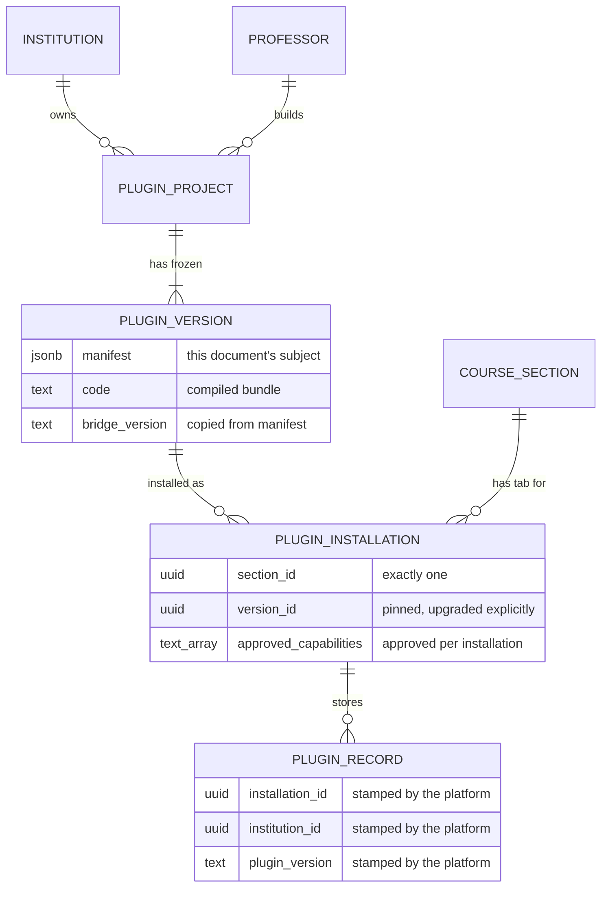

# Studio Plugin Manifest

What a Studio plugin is, and the file that declares it. Read [studio-plugin-rules.md](./studio-plugin-rules.md) first; rule numbers below cite it.

| | |
|---|---|
| **Status** | Review |
| **Manifest version** | 1 and 2 |
| **Owner** | Kevin Dohsi |
| **Date** | 2026-10-01 |
| **Code** | `src/lib/studio/manifest.ts` (schema and validator), `src/lib/studio/capabilities.ts` (capability list), `src/lib/studio/edtech.ts` (signal, purpose and AI-fallback lists) |
| **Example** | Version 1: `src/lib/studio/fixtures/exit-ticket/plugin.manifest.json`. Version 2: `GOOD_MANIFEST` in `src/lib/studio/validator/fixtures.ts` |

## Where the manifest sits

The terms plugin project, plugin version, plugin installation and Scholera Bridge are defined in the [rules doc](./studio-plugin-rules.md#words-used-in-this-document). A manifest belongs to a **version**. Data, capability approval and state belong to an **installation** (rules 1.5, 2.4).



Two consequences:

- **The manifest names no course.** It describes a version, and one version can be installed in several sections. So it never contains a section, institution or user ID. The validator rejects any field it doesn't define, so there is nowhere to put one (rule 2.1).
- **Approval can't live in the manifest.** The manifest says what a version asks for. Which of those a section's professor granted is stored on the installation, because the same version can be approved differently in two sections.

The tables are described in [studio-plugin-storage.md](./studio-plugin-storage.md). The diagram shows the model, not the exact schema.

## The manifest

A plugin's manifest is the file `plugin.manifest.json` at the root of its source. The platform trusts the manifest, not the code. The plugin card (rule 8.2) is built from it, and the Scholera Bridge allows a capability only if the manifest lists it and the installation approved it (rule 1.5).

```json
{
  "manifestVersion": 1,
  "id": "exit-ticket",
  "name": "Exit ticket",
  "description": "At the end of a lecture, students answer a few short questions ...",
  "version": "1.0.0",
  "bridgeVersion": "v1",
  "views": {
    "student":   { "entry": "views/student.tsx",   "capabilities": ["context.get", "ui.resize"] },
    "professor": { "entry": "views/professor.tsx", "capabilities": ["context.get", "course.skills", "course.weakSpots", "ui.resize", "ui.toast"] }
  },
  "collections": {
    "questions": { "access": "shared",     "fields": { "prompt": "text", "skill": "text", "open": "boolean" } },
    "responses": { "access": "perStudent", "fields": { "questionId": "text", "answer": "text", "confidence": "number" } }
  }
}
```

### Fields

| Field | Rule | Why |
|---|---|---|
| `manifestVersion` | `1` or `2`. | The version of this file format. Every field is required and unknown fields are rejected. So adding a field means a new manifest version, and version 1 files keep parsing exactly as they always did. Version 2 adds four fields, described in [Manifest version 2](#manifest-version-2). |
| `id` | Lowercase words joined by hyphens, up to 40 characters. | A readable name for the project that stays the same across versions. It isn't a database key. The platform gives each project its own ID, so two professors can both have an `exit-ticket`. |
| `name`, `description` | 1 to 80 and 1 to 300 characters. | Shown on the plugin card and the course tab. |
| `version` | `MAJOR.MINOR.PATCH`, like `1.2.0`. No `v` prefix, no leading zeros, no `-beta`. | See [Versions](#versions). |
| `bridgeVersion` | One the platform serves: `v1` or `v2`. New drafts are `v2`. | This is the Scholera SDK compatibility field. It names the bridge protocol and plugin kit the code was built against. The platform keeps every served version working (rule 8.7). |
| `views.student`, `views.professor` | Both required. No other view is accepted. | Every plugin has a student view and a professor view. TAs and graders see the professor view, and the bridge limits what their role can write. A plugin can't invent a role (rule 9.4). |
| `views.*.entry` | A relative `.tsx` path inside the plugin's source, lowercase, like `views/student.tsx`. | The file the build compiles for that view. The pattern rules out `..`, absolute paths, backslashes and URLs, so an entry can't point outside the plugin. |
| `views.*.capabilities` | Names from the capability list, allowed for that view. | See [Capabilities](#capabilities). |
| `collections` | Up to 10, camelCase names. May be empty. | The plugin's data. See [Collections](#collections). |

### Capabilities

A capability is one thing the Scholera Bridge does for a plugin (rule 1.4). Each view lists the ones it uses. The professor approves them for each installation, and the bridge refuses anything else (rule 1.5).

Capabilities are declared per view, not once for the whole plugin. That's what lets the validator enforce rule 4.5 before publish: class-wide data never reaches a student's screen. The plugin card can also say exactly what the student's screen is able to do.

| Capability | What the professor reads | Student view | Professor view |
|---|---|---|---|
| `context.get` | See this course's name and whether the person using it is a student or staff | yes | yes |
| `course.skills` | Read this course's skill list | yes | yes |
| `course.weakSpots` | See which skills the class is struggling with | **no** (rule 4.1) | yes |
| `course.roster` | See which students are in this course. Names are shown by Scholera and never given to the tool | **no** (rule 4.1) | yes |
| `course.assignments` | Read this course's published assignments and due dates | yes | yes |
| `ui.resize` | Fit itself to the page | yes | yes |
| `ui.toast` | Show short notifications | yes | yes |

`course.weakSpots` is registered, so a manifest that declares it parses, but no Bridge method exists for it yet. The builder refuses it (`capability_unavailable`), and a call to it is answered `unsupported`.

Data reads and writes are not capabilities. Declaring a collection is what grants access to it, on the terms of its `access` rule. That avoids asking the professor to approve the same thing twice.

The validator rejects two different mistakes with different messages, so Athena can repair the manifest:

- **Unknown:** a name the bridge doesn't have, like `network.fetch`.
- **Not allowed here:** a real capability requested by a view that may not use it, like `course.weakSpots` in the student view.

### Collections

Rule 3.2 requires every plugin to declare the shape of its data. A collection is a named set of records with fixed fields.

| `access` | Student view | Professor view | Use it for |
|---|---|---|---|
| `perStudent` | Reads and writes only records it owns | Reads every student's records | Answers, attempts, reflections |
| `staffPerStudent` | Reads only records about this student, writes none | Reads every record; professors and TAs write one about a named student | Attendance, check-ins, notes back to one student |
| `shared` | Reads | Reads and writes | Questions, prompts, settings the class sees |
| `staffOnly` | Never sent to the frame | Reads and writes | Answer keys (rule 5.2), professor notes |

A `staffPerStudent` create names its student by handle (`student`), as `course.roster` and staff reads return it. A record staff write about a student counts toward the installation's storage, not the student's own allowance.

Fields are `text`, `number` or `boolean`, and every field is required. A collection needs at least one field and allows at most 30.

A plugin can't declare a field named `id`, `institutionId`, `sectionId`, `installationId`, `pluginId`, `pluginVersion`, `userId`, `studentId`, `authorId`, `createdAt` or `updatedAt`, in any capitalization. The platform stamps who wrote a record and where on every record (rule 3.3). A plugin-supplied `studentId` would be something the plugin could fake, and a reader could mistake it for the real stamp.

## Versions

A project's versions are numbered by the plugin's `version` field. The manifest validator only checks the format. Publishing is checked by the database (`studio_plugin_versions`), so no code path can skip it:

- **Higher than the last.** A new version must be higher than every version the project already published.
- **Same project.** The manifest's `id` must equal the project's slug.
- **Only compatible changes in version 1.** Every collection the previous version declared must appear unchanged: same access rule, same fields, same types. A new version can add collections, capabilities and code.

That last rule is what makes upgrades and rollbacks safe for stored data. Records belong to the installation, not the version (rule 3.3). Every version of a project reads the same collections the same way, so moving an installation between versions never strands a record.

- **Patch.** Code changes only.
- **Minor.** Adds capabilities or collections.
- **Major. Deferred.** Changing or removing an existing field or collection is refused at publish in version 1. Supporting it needs a decision about existing records (archive them, or migrate them) and about students mid-attempt (rule 8.4). That arrives with the grading slice, which is also where attempts are built.

## Manifest version 2

Version 2 adds what the pre-publish validator checks for rules 3.4, 4.3, 6.2 and 9.6. Everything in version 1 is unchanged and still required.

```json
{
  "manifestVersion": 2,
  "...": "every version 1 field",
  "purpose": {
    "category": "reflection",
    "summary": "Students write what was unclear today, and the professor reads the answers to plan the next class.",
    "audience": "both"
  },
  "signals": ["submitted"],
  "skillSlots": [{ "key": "topic", "label": "The topic this ticket is about" }],
  "aiFallback": "not-applicable"
}
```

| Field | Rule | Why |
|---|---|---|
| `purpose.category` | One of `practice`, `assessment`, `feedback`, `reflection`, `discussion`, `content-exploration`, `course-logistics`. | Rule 9.6: Studio builds only tools for teaching, learning or running the course. The validator checks the summary against this category. |
| `purpose.summary` | 20 to 300 characters. | One plain sentence saying what students do and how it helps them learn. The validator's purpose check reads it, so it's treated as untrusted text. |
| `purpose.audience` | `students`, `staff` or `both`. | Who the tool is for. |
| `signals` | Names from the shared list: `completed`, `score`, `timeSpent`, `attended`, `submitted`. Each at most once. May be empty. | Rule 3.4: tracking uses the shared list, so dashboards add up across plugins. |
| `skillSlots` | Up to 10. Each has a camelCase `key` and a `label` of 1 to 80 characters. Keys are unique. May be empty. | Rule 4.3: a slot names a concept the tool's scores count toward. It never names a section's skill, because a version belongs to no section. See [Skill slots](#skill-slots). |
| `aiFallback` | `not-applicable`, `works-without-ai` or `explains-unavailable`. | Rule 6.2: what the tool does when the AI kill switch turns its AI off. A tool whose views ask for an AI capability can't say `not-applicable`. A tool with no AI capability must say `not-applicable`. No capability uses AI yet, so every version 2 manifest says `not-applicable` today. |

**Version 1 stays version 1.** A version 1 manifest is never read as version 2, and a version 2 field in a version 1 file is rejected as unknown. Published version 1 versions keep working where they are. They can't pass the validator, because its checks for rules 3.4, 4.3, 6.2 and 9.6 need the version 2 fields. So a version 1 tool can't be shown to students. Republishing it as version 2 is the way forward.

### Skill slots

A slot is declared on the version and bound in each installation:

1. The manifest declares `{ "key": "topic", "label": "The topic this ticket is about" }`.
2. In each course that installs the tool, the professor picks which of the course's skills the slot means. The binding belongs to the installation, like capability approval (rule 1.5). The database refuses a skill from another section.
3. The tool can't be shown to students until every slot is bound to a skill that still exists, isn't hidden and isn't suppressed in that section.
4. At runtime, `context.get` returns `skills: { "topic": "Photosynthesis" }`: the bound skill's name, or `null`. The plugin never receives a skill ID.

## What the manifest deliberately leaves out

- **Code, secrets, URLs.** Code is stored beside the manifest in the version, not inside it. The plugin never holds a secret (rule 1.3). The frame can't reach the network, so a URL would be useless (rule 1.2).
- **Any course, user or institution.** Covered above.
- **A section's skills.** A version names skill slots, never skill IDs. Each installation binds its own (rule 4.3).

## Validating a manifest

```ts
import { parseManifest, parseManifestFile } from '@/lib/studio/manifest'

const result = parseManifestFile(text) // or parseManifest(alreadyParsedJson)
if (!result.ok) result.issues // ["views.student: Every plugin needs a student view", ...]
```

Each issue reads `path: message`. It's written for two readers: Athena repairing its own output, and a professor seeing why publishing was refused.

Keys the plugin chooses, meaning collection and field names, are checked on the raw input. Zod's record parser drops a `__proto__` key without reporting it. So checking its output would accept a manifest that differs from the file.

## Related documents

- **Storage** of versions, installations and records: [studio-plugin-storage.md](./studio-plugin-storage.md).
- **Runtime isolation**, including what a sandboxed frame does not block by itself, is covered by the [rules doc appendix](./studio-plugin-rules.md#appendix-network-isolation-in-the-sandboxed-frame).
