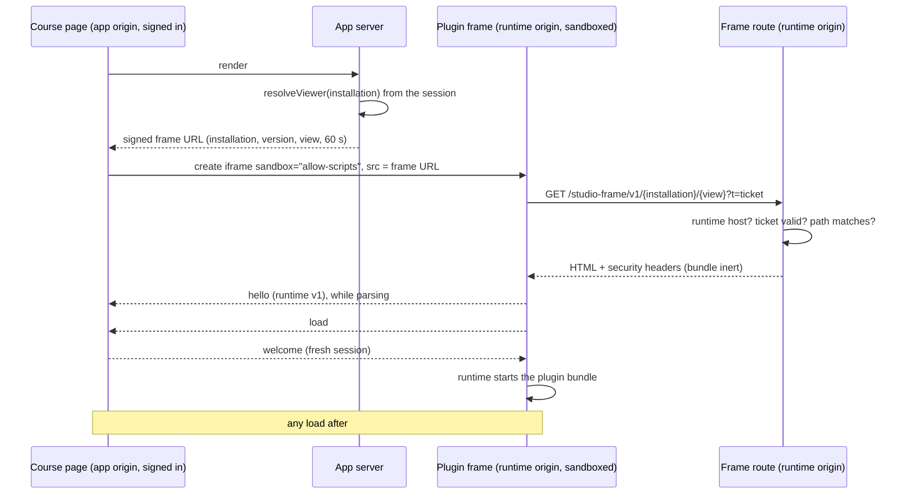

# Studio Plugin Runtime

Where plugin code runs, how it is isolated, and how it talks to Scholera. Rule numbers cite [studio-plugin-rules.md](./studio-plugin-rules.md), which wins any disagreement. N1 to N11 are that file's network-isolation appendix.

| | |
|---|---|
| **Status** | Runtime shell (4B), bridge (4C), runtime capabilities and hardening (4D), and student access with the status heartbeat (5B) built. Student access is off in production behind `STUDIO_STUDENT_ACCESS`; see [studio-plugin-publication.md](./studio-plugin-publication.md) |
| **Owner** | Kevin Dohsi |
| **Date** | 2026-10-01 |
| **Code** | `src/lib/studio/runtime/` (`origin.ts`, `frame-document.ts`, `frame-ticket.ts`, `frame.ts`, `protocol.ts`, `host.ts`, `host-methods.ts`, `bridge-client.ts`, `preview-bridge.ts`), `src/lib/studio/bridge/` (`catalog.ts`, `registry.ts`, `dispatch.ts`, `envelope.ts`, `read-body.ts`, `rate-limit.ts`, `context-get.ts`), `src/app/api/studio/bridge/route.ts`, `src/app/studio-frame/v1/[installationId]/[view]/route.ts`, `src/app/(dashboard)/professor/courses/[sectionId]/studio/[installationId]/page.tsx`, `public/studio-runtime/v1/runtime.js`, `src/components/studio/runtime/`, `src/middleware.ts`, `next.config.ts` |
| **Tests** | `src/__tests__/studio-runtime.test.ts`, `studio-runtime-host.test.ts`, `studio-bridge.test.ts`, `studio-runtime-page.test.ts`; database: `src/__tests__/db/studio-bridge-dispatch.test.ts`; browsers: `npm run e2e:studio-runtime` |

## How a plugin frame loads



## Two origins

| | App origin | Runtime origin |
|---|---|---|
| Role | Scholera itself. Trusted | Plugin frames. Untrusted, credential-free |
| Set by | `SITE_URL` (or `NEXT_PUBLIC_SITE_URL`), the same as `getSiteUrl()` | `STUDIO_RUNTIME_ORIGIN` |
| Serves | The whole app. `/studio-frame/*` is a 404 here | Only `/studio-frame/v1/*` and `/studio-runtime/v1/*`. Everything else is a 404 |
| Cookies | The session cookie, host-only (no `Domain`, `src/lib/supabase/cookie-options.ts`) | None. The browser never sends the app's cookies to another host |

Both are served by the same Next.js server; the request's host decides which role it plays. `middleware.ts` applies that before anything else, so on the runtime origin no app page renders and no session code runs.

**Fails closed.** `studioOrigins()` turns the runtime off if `STUDIO_RUNTIME_ORIGIN` is unset, isn't a bare `http(s)` origin, equals the app's host, is a subdomain or parent of it, or (in production) isn't `https`. A different **registrable domain** is required in production. That isn't checkable without a public-suffix list, so it's a deployment requirement (below).

**Local development.** Browse the app at `http://localhost:3000` and set `STUDIO_RUNTIME_ORIGIN=http://127.0.0.1:3000`. An IP and `localhost` are different sites to the browser, so the same dev server genuinely plays both roles, with no cookie shared between them. The browser tests use the same trick on separate ports.

## Static assets on the runtime origin

`middleware.ts` doesn't run for `/_next/static/*`, `/_next/image` or public image files, so the runtime origin serves those too. Reviewed in Step 4C, this is harmless:
- **Nothing private.** They're the same build outputs and public files the app origin serves to anyone, signed in or not. They hold no secrets and no per-user data.
- **Nothing can run them there.** The runtime origin serves no HTML page except plugin frame documents, whose security policy allows exactly one script file and one nonce. App chunks can't execute in that context.
- **Nothing to steal.** Even if something did run there, the runtime origin holds no cookies, session or storage: the dedicated-origin boundary is about credentials, and those never exist on it.
- **`/_next/image`** is exactly as available on the app origin, so it adds no new exposure.

Moving the guard ahead of Next's static handling would need a custom server, and would protect nothing.

## Authorizing one frame: tickets

The runtime origin gets no session cookie, so it can't run `resolveViewer`. The app origin does, and signs its decision:

1. `issueFrameUrl(installationId, view)`, on the app server, runs `resolveViewer`. A student may get only the `student` view. Staff may get either; a staff preview of the student view still runs on the host-only mock bridge.
2. It returns `{runtime}/studio-frame/v1/{installation}/{view}?t={ticket}`. The ticket is the installation, the current version, the view and an expiry `STUDIO_FRAME_TICKET_TTL_MS` (60 s) ahead, signed with HMAC-SHA256 using `STUDIO_FRAME_TICKET_SECRET`.
3. The frame route checks: the request's host is the runtime origin; the ticket's signature is valid (constant-time compare) and it hasn't expired; the path names the same installation and view. Then it serves that version's bundle for that view. Every failure is the same plain 404.

The ticket holds **no user** (rule 2.5). It isn't a secret, because the plugin can read its own URL. It's tamper-proof and short-lived, which is what stops a student who knows a version from asking for the professor bundle.

**What a leaked ticket grants (reviewed in Step 4C).** Treat every ticket as exfiltrated: the plugin can read its URL and navigate itself.
- For up to 60 seconds, a replay fetches that frame document again. That is the plugin's own code for that one view, which the plugin already holds.
- A ticket can't be changed to another view, installation or version (the signature), and it expires.
- It authenticates nothing else. The frame route is the only thing that reads tickets. The bridge ignores them and requires the viewer's own session cookie on Scholera's origin, plus Scholera's `Origin` (tested: a request with a ticket and no session gets 401).
- It reaches no course or user data: the frame document holds only the runtime script and the bundle.

So replay grants nothing a malicious plugin doesn't already have. A single-use ticket would need a server-side store and would protect nothing more, so tickets stay stateless.

One condition keeps this true: **bundles must never contain sensitive data.** That's already rule 5.2 for answer keys. The pre-publish validator (F5) must keep enforcing it, because a bundle is effectively readable by anyone who obtains a ticket.

## The frame document

Built by `frame-document.ts` and identical in the route and the browser tests:

- one `<script>`: `{runtime}/studio-runtime/v1/runtime.js`;
- the plugin bundle as **inert text**: `<script type="text/plain" id="studio-plugin-bundle" nonce="…">`, with `</script` and `<!--` escaped (case kept);
- no IDs, no session data.

The runtime sends `hello` as the document parses, but starts the bundle only after the host's `welcome`. The host sends `welcome` only after the frame's first `load` event. So plugin code can't run until the host is counting loads, and **every** navigation it causes is load #2. Without this ordering, a plugin that navigated during parsing would abort the original document before its load, and the attacker page's load would look like the first.

### Security headers

```
Content-Security-Policy:
  default-src 'none';
  script-src {runtime}/studio-runtime/v1/runtime.js 'nonce-{per response}';
  style-src {runtime}/studio-runtime/v1/;
  font-src {runtime}/studio-runtime/v1/fonts/;
  img-src 'none'; media-src 'none'; connect-src 'none';
  frame-src 'none'; child-src 'none'; worker-src 'none';
  object-src 'none'; manifest-src 'none';
  base-uri 'none'; form-action 'none';
  frame-ancestors {app origin};
  sandbox allow-scripts
Permissions-Policy: camera=(), microphone=(), geolocation=(), … (every powerful feature off)
Referrer-Policy: no-referrer
X-Content-Type-Options: nosniff
X-DNS-Prefetch-Control: off
Cache-Control: no-store
```

- No `'unsafe-inline'`, `'unsafe-eval'`, `'self'`, wildcards, `data:` or `blob:` anywhere. React sets styles through the CSSOM, which the policy doesn't restrict, so inline styles aren't needed.
- `frame-ancestors` names the app origin explicitly, because `'self'` is ambiguous for a document the `sandbox` directive makes opaque.
- The app's global `X-Frame-Options: SAMEORIGIN` and `frame-ancestors 'self'` skip `/studio-frame/` (`next.config.ts`; the exclusion is tested with Next's own path matcher), because they would block the deliberate cross-origin framing.
- The `kit.css` stylesheet and fonts under `/studio-runtime/v1/` arrive with the plugin kit. The policy already reserves exactly that path.

### The iframe element

`sandbox="allow-scripts"`, `allow=""`, `referrerpolicy="no-referrer"`, `src` set before insertion. Never enabled: `allow-same-origin`, `allow-forms`, `allow-popups`, `allow-popups-to-escape-sandbox`, any `allow-top-navigation*`, `allow-modals`, `allow-downloads`, `allow-pointer-lock`, `allow-presentation`, `allow-storage-access-by-user-activation`, or any `allow=` permission. The attribute and the header's `sandbox` directive both apply, so one misconfiguration doesn't drop the sandbox.

## The bridge envelope, v1

Every message is `{ scholera: 'bridge', v: 1, type, … }` (`protocol.ts`; `runtime.js` speaks the same shapes).

| Direction | Type | Fields |
|---|---|---|
| Frame to host | `hello` | `runtime` (`'v1'`) |
| Frame to host | `request` | `session`, `id` (`[A-Za-z0-9_-]{1,64}`), `method` (`namespace.name`), `args` (at most `STUDIO_BRIDGE_MAX_MESSAGE_BYTES`, 64 KiB) |
| Frame to host | `crash` | `session`, `message` (cut to 500 characters) |
| Host to frame | `welcome` | `session`, `context: { runtime, view, theme }`. No IDs (rule 2.5) |
| Host to frame | `response` | `session`, `id`, `ok`, then `data` or `error: { code, message }` |

Error codes: `not_available`, `invalid`, `conflict`, `rate_limited`, `unsupported`, `failed`, `stale`, `full` (the installation's storage quota refused a write), and `unavailable` (this viewer can't use this installation any more: hidden, Studio switched off, release gate closed, or it never existed, one answer for all). A plugin never receives `unavailable`: the host stops the frame instead.

**Frame identity:**
- The host accepts a message only when `event.source` is its own iframe's window (N2). The origin is `"null"` for every sandboxed frame.
- Every request must carry the current `session`, a random UUID the host creates at `welcome`. It isn't a secret. It ties messages to one document, because a reloaded or navigated frame keeps the same window object.
- A request whose `id` is still pending is refused. Responses go only to this frame (`targetOrigin` `*`, because an opaque origin can't be named, N3) and never after the frame has stopped.

**What stops a frame,** removing the iframe:

| Stop | Trigger |
|---|---|
| `start-timeout` | No load within `STUDIO_FRAME_START_TIMEOUT_MS` (10 s) |
| `hello-timeout` | No valid `hello` within `STUDIO_FRAME_HELLO_TIMEOUT_MS` (5 s) of the first load |
| `unsupported-runtime` | `hello` names a runtime not in `BRIDGE_VERSIONS` |
| `navigated` | A second load event |
| `malformed` | More than `STUDIO_FRAME_MALFORMED_MAX` (20) bad or stale messages |
| `crashed` | A `crash` from the current session |
| `throttled` | More than `STUDIO_FRAME_RATE_ABUSE_MAX` (60) requests refused for rate in one minute |
| `unavailable` | A bridge call or the status heartbeat answers `unavailable` |

Recovery is always a new iframe element with a fresh ticket and a fresh session.

### Runtime states

`host.ts` reports one of five states. Its snapshot type is a separate shape per state, so impossible combinations (a session on a stopped frame, a stop reason on a running one) can't be expressed.

| State | Means | Carries |
|---|---|---|
| `loading` | The iframe is in the page; its document hasn't loaded | load and strike counts |
| `handshaking` | Loaded; waiting for a valid `hello` | load and strike counts |
| `ready` | Plugin running; requests answered | `session`, `readOnly` |
| `stale` | The installation moved to another version while this frame was open | `session` |
| `stopped` | Terminal; the iframe has been removed | `reason` |

**Creating** the iframe happens synchronously inside `mountPluginFrame`, before the first snapshot, so it is never an observable state.

The other names you might expect are deliberately not states of their own:
- **Read-only** is `ready` with `readOnly: true`: the frame runs normally, but writes are refused. It starts from the page (`!viewer.writable`) and the heartbeat can change it either way while the frame runs.
- **Throttled, crashed and unsupported** are `stopped` with that `reason`: each ends the frame.

| From | To | When |
|---|---|---|
| `loading` | `handshaking` | First `load`, no `hello` yet |
| `loading` | `ready` | First `load`, `hello` already received |
| `handshaking` | `ready` | Valid `hello` |
| `ready` | `stale` | A call or the heartbeat answers `stale` |
| `ready`, `stale` | `stopped` | A call or the heartbeat answers `unavailable` |
| `loading`, `handshaking` | `stopped` | Start or hello timeout, unsupported runtime, too many bad messages, unmount |
| `ready`, `stale` | `stopped` | Second `load` (navigation), crash, too many bad messages, throttled, unmount |

`stale` never returns to `ready`, and `stopped` never changes: recovery is a new frame.

### Status heartbeat

A running live frame asks `/api/studio/bridge` whether it may keep running every `STUDIO_FRAME_STATUS_INTERVAL_MS` (60 s), with `{ v: 1, type: 'status', installationId, expectedVersionId }`. The answer is one of `available`, `readOnly`, `stale` or `unavailable`, and nothing else. It goes through the same origin, session and rate checks as a call, then `resolveViewer`. This is how a plugin that never calls the bridge still learns it was hidden, that Studio was switched off, or that the school lost Studio. One check runs at a time, a failed check changes nothing, preview frames have none, and it stops with the frame. Details: [studio-plugin-publication.md](./studio-plugin-publication.md#open-frames-the-heartbeat).

## The bridge

```
Plugin  -- postMessage -->  Host (Scholera page)  -- HTTPS POST -->  /api/studio/bridge  -->  dispatch()  -->  Step 3 trusted path  -->  database
```

The plugin never makes a network request; the host does. The host's checks are **containment**. The server's checks are **authorization**: an authenticated user calling `/api/studio/bridge` by hand, with any body, still can't do more than their role allows.

| Step | Where | What |
|---|---|---|
| Frame identity | Host | `event.source` is this frame; the session is current |
| Message shape and size | Host | v1 envelope; `args` at most 64 KiB |
| Allowed methods | Host | Only methods this view of the manifest may call (`allowedBridgeMethods`); others refused before the network |
| Stale | Host | Once the frame is `stale`, every request is refused locally |
| Read-only | Host | When the viewer may not write (archived installation or section, lost entitlement, completed enrollment), write methods are refused locally (the server refuses them too) |
| Host-only methods | Host | `ui.resize` and `ui.toast` are answered by the page and never sent |
| Per-frame rate | Host | `STUDIO_BRIDGE_CALLS_PER_MINUTE` per frame; a frame that keeps going is stopped (`throttled`) |
| Origin | Route | `Origin` must be Scholera's app origin |
| Content type | Route | `application/json` only |
| Body size | Route | `STUDIO_BRIDGE_MAX_MESSAGE_BYTES` (64 KiB), counted while the stream is read, so a missing, wrong or chunked `Content-Length` can't bypass it. Over the cap is refused before parsing |
| Envelope | Route | Strict: `v`, `type`, `installationId`, `method`, `args`, `host`. No user, role, section, institution, version, author or owner field can be sent |
| Session | Route | The viewer's own Scholera session (401 without one) |
| Rate | Route | Per user across everything, then per user per installation (below) |
| Viewer | Step 3 | `resolveViewer`: the session, the installation (a claim it verifies), the role, student visibility and the release gate, the kill switch, the current version, the stored manifest re-checked. No viewer is `unavailable` |
| Version current | Route | The frame's `expectedVersionId` must be the installation's current version; otherwise `stale`, before dispatch |
| Runs on the server | `dispatch()` | Host-only methods are refused here, whoever sends them |
| Method exists | `dispatch()` | Only methods in the registry |
| View may call it | `dispatch()` | The registry's views |
| Capability declared | `dispatch()` | In the current view of the manifest (rule 1.5) |
| Version approved | Database | The current version always has an approval row for the installation (Step 2's key); v1 approval is all-or-nothing |
| Capability allowed for the view | `dispatch()` | Class-wide capabilities never in the student view (rules 4.1, 4.5) |
| Arguments | Registry | Strict schema per method; record methods can't name the installation |
| Records | Step 3 | `records.ts` alone applies `perStudent`, `shared`, `staffOnly`, read-only and ownership rules |
| Storage quota | Database | A write past the installation's quota is undone by the usage trigger and answered `full` |
| Response | Route | Generic messages; no stack traces, database details or IDs beyond record IDs |

### The method catalog

`src/lib/studio/bridge/catalog.ts` is the one list of methods, shared by the host and the server. A method not in it doesn't exist. Each entry says where it runs, the manifest capability it needs, which views may call it, whether it reads or writes, and its strict argument schema. The server's handlers live in `registry.ts`, and a type requires exactly one handler per server method. Adding a capability later (course memory, AI, notifications, grading) is one catalog entry plus, for a server method, one handler. The bridge's architecture doesn't change.

| Method | Runs | Manifest capability | Kind |
|---|---|---|---|
| `context.get` | server | `context.get` | read |
| `course.skills` | server | `course.skills` | read |
| `records.list`, `records.get` | server | none: a declared collection grants access | read |
| `records.create`, `records.update`, `records.delete` | server | none | write |
| `ui.resize` | host | `ui.resize` | read |
| `ui.toast` | host | `ui.toast` | read |

Every method is available to both views, subject to the manifest and to the capability's own allowed views (`capabilities.ts`). No authorization logic lives in UI components: `PluginHost` only passes the server-computed `allowedMethods` to the controller.

### `course.skills`

The section's skills, in curriculum order:

```
[{ name, info, parent }]
```

- **Hidden skills are left out.** That's anything the professor excluded, or a suppressed (not yet confirmed) suggestion, the same rule the grade hook uses.
- **`parent` is the parent's name, or `null`.** It's also `null` when the parent itself is hidden, so a hidden skill's name never leaks through a child.
- **No IDs at all:** no skill, section, institution, user or database ID. IDs are used inside the query only, to resolve parent names.
- **Bounded:** at most `STUDIO_SKILLS_MAX` (500) skills.
- **Takes no arguments.**

### `context.get`

```
{ plugin: { name, version }, view, theme: 'light', locale, timeZone,
  course: { code, title }, readOnly, can: { [collection]: { read, write } } }
```

- No user, student, section, institution, installation or database ID, and no name or email.
- `locale` and `timeZone` are the viewer's own browser settings, read by the host from `Intl`, never supplied by the plugin.
- `readOnly` means the viewer may not write right now (see `writable` in [studio-plugin-server.md](./studio-plugin-server.md)).
- `can` is computed by the same `decide()` the server enforces. It lets a plugin hide controls; it grants nothing.

### Rate limits

| Setting | Value | Scope |
|---|---|---|
| `STUDIO_BRIDGE_USER_CALLS_PER_MINUTE` | 300 | Per user across every installation and method |
| `STUDIO_BRIDGE_CALLS_PER_MINUTE` | 120 | Per user per installation, every method; also per frame in the host |
| `STUDIO_BRIDGE_WRITES_PER_MINUTE` | 30 | Per user per installation, write methods (also counted above) |

They are checked in that order, stopping at the first refusal.

**The per-user limit runs before the installation is looked up.** A call naming a made-up installation still spends it, so rotating installation IDs can't multiply a user's budget beyond 300 lookups a minute. The value is 2.5 installations' worth: a professor can run two or three plugins flat out at once without hitting it.

Over any limit is `429` with `Retry-After: 60`.

**In-memory limits are per process and per Cloud Run instance. They are not globally authoritative.** A user spread across instances gets each instance's budget. That's acceptable for these methods, which cost no money. Anything with a monetary cost, AI above all, must use a durable, global counter before release (the `athena_increment_rate_limit` pattern).

### Stale frames

When the professor upgrades or rolls back an installation, an open frame is running code built for a version that is no longer current. It must not go on as if it were.

1. **The page knows the version.** It passes the frame's version to the host, and the host sends it with every call as `expectedVersionId`. The version itself is never taken from the request: the server always uses the installation's current version.
2. **The route compares.** If `expectedVersionId` isn't the current version, it answers `stale` before dispatching, so a stale frame can't read or write.
3. **The host freezes the frame.** It moves to `stale` and refuses every later request locally. It shows "A newer version of this tool is in use" with a Reload button.
4. **Nothing reloads by itself,** and a running frame is never moved onto new code. In-flight requests finish, and the plugin's own state stays on screen until the viewer reloads. A reload means a new ticket for the current version and a new frame.

Rollback is the same comparison, so it makes a frame built for the newer version stale too. Pinning a student's attempt to its starting version is a different mechanism, which belongs to the grading slice.

### Host-only methods

`ui.resize` and `ui.toast` are answered by the host (`host-methods.ts`) and never reach `/api/studio/bridge`; the server refuses them if they're sent anyway. They still need their capability declared, and they count against the frame's rate.

| Method | Arguments | What the host does |
|---|---|---|
| `ui.resize` | `{ height }`: an integer from 0 to 100,000 | Clamps it to `STUDIO_FRAME_MIN_HEIGHT_PX` (160) to `STUDIO_FRAME_MAX_HEIGHT_PX` (2400), applies that, and returns the height it chose |
| `ui.toast` | `{ message, tone? }`: 1 to `STUDIO_TOAST_MAX_CHARS` (160) characters, tone `info`, `success` or `error` | Shows a Scholera toast with the message as plain text, labelled "From {plugin name}" so it can't pass for a message from Scholera. At most `STUDIO_TOASTS_PER_MINUTE` (6) per frame |

No HTML, styles, links or extra fields are accepted. HTML-like text is shown exactly as written, never interpreted.

### Preview

Preview (rule 8.3) runs the student view, served by a normal frame ticket, against `preview-bridge.ts`. That's an in-memory bridge in the host page with sample data generated from the manifest. It applies the same `decide()` and record validation as the server, so a plugin behaves the same way. It never calls `/api/studio/bridge` or any network, never writes a Studio record, and never changes publication (tested in unit and browser tests).

### Stop logging

The host reports every stop except an intentional unmount and `unavailable` (the server's own decision): navigated, malformed, unsupported runtime, crashed, either startup timeout, and throttled. It reports each as a bridge `event` with the reason only. The server logs `studio.runtime.stopped` with the installation, version and reason, never plugin data or crash text. Events are rate-limited like calls, so a looping plugin can't flood the audit log.

## Isolation matrix

Measured on 2026-10-01 with Playwright 1.61's Chromium, Firefox and WebKit, against `e2e/studio-runtime`.

"Blocked" means two things held together: the plugin's own attempt failed, **and** nothing arrived at the test's attacker server. The attacker server is proven live by the self-navigation test, where the request does arrive.

| Channel | Enforced by | Chromium | Firefox | WebKit |
|---|---|---|---|---|
| Host DOM (`parent.document`, `top.document`, `parent.location`) | Dedicated origin, Sandbox | Blocked | Blocked | Blocked |
| App cookies | Sandbox (opaque origin), Dedicated origin (cookies never sent) | Blocked | Blocked | Blocked |
| `localStorage`, `sessionStorage`, IndexedDB, Cache Storage | Sandbox (opaque origin) | Blocked | Blocked | Blocked |
| `fetch`, XHR, WebSocket, EventSource, `sendBeacon` | CSP (`connect-src`) | Blocked | Blocked | Blocked |
| Images, CSS `url()` images | CSP (`img-src`) | Blocked | Blocked | Blocked |
| Scripts, `eval`, `new Function`, inline script without the nonce | CSP (`script-src`) | Blocked | Blocked | Blocked |
| Stylesheets, fonts, media | CSP (`style-src`, `font-src`, `media-src`) | Blocked | Blocked | Blocked |
| Form submission | Sandbox (no `allow-forms`), CSP (`form-action`) | Blocked | Blocked | Blocked |
| Workers (URL and `blob:`), SharedWorker | CSP (`worker-src`) | Blocked | Blocked | Blocked |
| Service worker registration | Sandbox (opaque origin) | Blocked | Blocked | Blocked |
| Nested frames | CSP (`frame-src`, `child-src`) | Blocked | Blocked | Blocked |
| Popups, `window.open` | Sandbox | Blocked | Blocked | Blocked |
| Top navigation | Sandbox | Blocked | Blocked | Blocked |
| Downloads | Sandbox (no `allow-downloads`) | Blocked | Blocked | Blocked |
| WebRTC | Runtime removes the constructors (N10); browser limitation | Constructor removed; child-frame route also failed | Same | Same |
| DNS prefetch, preconnect | Runtime removes the elements, `X-DNS-Prefetch-Control: off` (N11); browser limitation | Removed; no connection reached the attacker | Same | Same |
| Framed by a site that isn't Scholera | CSP (`frame-ancestors`) | Didn't run | Didn't run | Didn't run |
| Frame URL opened directly | CSP (`sandbox` directive) | Opaque origin, no storage | Same | Same |
| **Self-navigation** | **Host detection only** | Request **reached** the attacker; frame then stopped | Same | Same |
| Device APIs (camera, mic, clipboard, location) | `allow=""`, `Permissions-Policy` | Configured, not probed | Same | Same |
| Memory side channels | Dedicated origin (separate site, so separate process where the browser does site isolation) | Not testable here | Same | Same |

**Self-navigation: detection is not prevention.** Anything already present in the frame must be treated as potentially exfiltratable.

A plugin can always set its own `location` to a URL carrying data, and no policy directive or sandbox token stops it. The host stops the frame on its second load and reports it (`onSecurityEvent`), but the request has already left.

WebRTC and DNS prefetch were contained in all three engines, but only by the runtime's own removals, which a determined script might find a way around in a future browser version. They stay classified as browser limitations and are re-measured by the probes, not assumed.

## What can and can't reach a plugin

**A fully malicious plugin can still:**
- leak, by self-navigation, anything it was given;
- spend the viewer's CPU;
- draw anything inside its own box (including a fake sign-in form);
- send the host junk until it's stopped;
- call the bridge methods its view declares, as often as the rate limits allow. Each call is authorized on the server by the viewer's own session and role.

**It can't:** read Scholera's cookies, storage or page; send a request or open a connection to anywhere (other than by navigating itself); open windows; navigate the page; download files; register workers or service workers; run code other than its own bundle; pretend to be another frame; or receive anything after it's stopped.

**Data that must never enter a frame (rule 2.5):** user IDs, names, emails, section and institution IDs, and anything else the viewer couldn't already see. Professor views that need to tell students apart get per-installation pseudonymous handles. The frame's URL, which the plugin can read, carries its installation and version IDs inside the ticket. Neither identifies a person, and neither works without a Scholera session.

## Deploying the dedicated origin

Verify all of this again once the real runtime domain exists:

1. `STUDIO_RUNTIME_ORIGIN` is `https://` on a different registrable domain from `SITE_URL`, mapped to the same Cloud Run service.
2. On the runtime domain, `/`, `/login`, `/api/*` and `/_next/data/*` return 404. `/studio-frame/v1/…` with a valid ticket returns the document.
3. On the app domain, `/studio-frame/v1/…` returns 404.
4. The frame response carries exactly the headers above, with no `X-Frame-Options`. Check with `curl -I`.
5. No `Set-Cookie` is ever sent from the runtime domain.
6. Middleware reads `STUDIO_RUNTIME_ORIGIN` at runtime in the deployed build. If the runtime origin were frozen at build time, the guard would be wrong.
7. `STUDIO_FRAME_TICKET_SECRET` is set as a Cloud Run secret, at least 32 characters, never in a `NEXT_PUBLIC_*` variable.
8. Run the isolation probes against the deployed origins, not just the local harness.

## Alternatives considered (Step 4A)

| Alternative | Why not |
|---|---|
| A `srcdoc` frame | Only a `<meta>` policy, which can't carry `sandbox`, `frame-ancestors` or reporting; it inherits the host page's policy; and the page, not an authorized route, would decide which bundle a viewer gets |
| Same origin without a sandbox | Hands every plugin the user's session. Never |
| In-page isolation (SES lockdown, ShadowRealm) | A JavaScript-level boundary, not a browser one; ShadowRealm isn't shipped |
| Server-rendered plugins | Puts untrusted code on our servers, the opposite of rule 1.1 |
| A server action for the bridge | No request-size control before parsing, and no streaming for future AI methods |
| Signed messages between frame and host | Protects against no sender we can't already identify with `event.source` and the session |
| **Plugin logic in a WebAssembly JavaScript interpreter in a worker, with the UI as a declarative tree the host renders** | **The recorded fallback.** No DOM, no network APIs and no navigation, so no exfiltration channel at all. It costs a large interpreter, a constrained component model the builder must target, and no free-form canvas or audio. Adopt it if self-navigation is ever judged unacceptable for the data plugins handle |

## Not built yet

- The professor's publish dialog. Student access itself is built (5B) and off in production; see [studio-plugin-publication.md](./studio-plugin-publication.md).
- AI capabilities, course search and class weak spots. AI needs a durable rate limit first.
- The plugin kit (`kit.css`, components, fonts).
