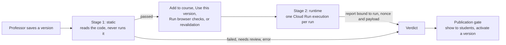

# Studio Plugin Validator

The pre-publish validator decides whether a published plugin version may reach students. It reads the version's code without running it (Stage 1), then runs it in a browser inside the student sandbox (Stage 2). A version reaches students only when both stages pass for its exact content, and every check that needed a human was approved by a Scholera reviewer. Read [studio-plugin-rules.md](./studio-plugin-rules.md) first; rule numbers below cite it.

| | |
|---|---|
| **Status** | Built and tested locally. The production Stage 2 runner (a Cloud Run job) is written but not deployed, so no version can pass in production yet |
| **Ruleset** | 2 (`STUDIO_VALIDATOR_RULESET`), validator `1.0.0`, Stage 2 report-binding version `v1` (`VALIDATOR_RUNTIME_VERSION`). That is not a plugin's bridge version: the runner reads that from the manifest |
| **Owner** | Kevin Dohsi |
| **Date** | 2026-10-02 (Step 10) |
| **Code** | `src/lib/studio/validator/` (checks, verdict, service, `cloud-runner.ts`, `pipelines.ts`), `validator-runtime/` (Stage 2 runner), `infra/validator-runner/` (the job), `src/lib/studio/prepublish.ts`, `src/lib/studio/skill-bindings.ts` |
| **Migration** | `20261001202323_studio_validator.sql`, `20261003020000_studio_release.sql` |
| **Tests** | `src/__tests__/studio-validator*.test.ts`, `studio-skill-bindings.test.ts`, `studio-release-ui.test.tsx`, `db/studio-validator.test.ts`, `e2e/studio-validator/` |

## What it's for

Most Studio rules are enforced by the sandbox and the Bridge, so a plugin physically can't break them. A few can't be enforced that way:

- **Navigation.** A plugin can navigate its own frame to a URL that carries data. The runtime detects this and stops the frame, but can't prevent it (rules appendix, N9).
- **Measured quality.** Phone layout, touch-target size, accessibility and empty, loading and error states (rules 7.3 to 7.5) can only be checked on the rendered tool.
- **Declarations.** Purpose, signals, skill slots and AI fallback (rules 9.6, 3.4, 4.3, 6.2) are claims the manifest makes. Something has to check them.

The validator checks these before students see a tool. It also re-checks, statically, the things the runtime already blocks, so a broken tool fails with a clear message instead of a blocked call in front of a student.

## The two stages

**Stage 1 (static)** runs on the app server right after publish, inside `publishVersion`. It reads the stored artifact and never evaluates it: the scanner parses each bundle with the TypeScript compiler API as a plain script and walks the syntax tree. A test fails the build if `eval`, `new Function` or `node:vm` ever appears in `src/lib/studio/validator/`.

**Stage 2 (runtime)** starts on its own after "Add to this course" or "Use this version in the course", and when the professor presses "Run browser checks", always after Stage 1 passed for the same content. Revalidation asks for it too (see [Ruleset and revalidation](#ruleset-and-revalidation)). If Stage 1 has no usable result (never ran, errored, or ran under a ruleset below the minimum), asking runs Stage 1 again first. Asking is refused while Studio is paused, when the school isn't entitled, for an archived installation, for a minute after a run of that stage ended in error (`STUDIO_VALIDATOR_RETRY_COOLDOWN_MS`), and outside the quotas in [Limits](#limits). A runner loads the plugin into the real frame document, Content Security Policy and sandbox that students get, in Chromium, and reports what it measured. It loads the runtime files of the manifest's own bridge version, `/studio-runtime/<bridgeVersion>/`, and stops before starting a browser for a bridge version it doesn't serve, so the run ends as `error` (it serves `v1` and `v2`, the same list as `BRIDGE_VERSIONS`). The runner never decides a verdict: the server does, from the measurements.

**Runner modes** (`src/lib/studio/validator/runtime-runner.ts`):

| Mode | When | What happens |
|---|---|---|
| `unavailable` | The default | The run is recorded as `error` with the reason "Browser checks can't run in this environment yet". The tool stays blocked |
| `local` | `STUDIO_VALIDATOR_RUNNER=local` on a developer machine (`onThisMachine`): `NODE_ENV` isn't `production`, or it is and `NEXT_PUBLIC_SUPABASE_URL` is a loopback address, as on the guarded local server (`e2e/serve-guarded.mjs`). A deployed app talks to a hosted database, so it never qualifies | `validator-runtime/cli.mjs` runs as a child process with an environment holding only `PATH`, temp and home paths, `PLAYWRIGHT_BROWSERS_PATH` and `NODE_ENV=production`. It reads the payload on stdin and prints the envelope. It is found under `STUDIO_VALIDATOR_RUNNER_ROOT`, the repository path, which defaults to the working directory and is needed when the server runs from a standalone build, since that build ships neither `validator-runtime` nor Playwright. No Scholera secret is in its environment, and Chromium's own OS sandbox stays on. A developer machine isn't an isolated environment: the runner could still read files such as `.env.local`, so this mode is for development only |
| `cloud` | `STUDIO_VALIDATOR_RUNNER=cloud` and all five `STUDIO_VALIDATOR_*` settings below | One Cloud Run job execution per run. See [The production runner](#the-production-runner) |

## The production runner

`infra/validator-runner/` holds the job, its image and `deploy.sh`; its README says which isolation properties are verified and which wait on a GCP project. The app side is `cloud-runner.ts`, driven by two background jobs in `pipelines.ts`.

1. **Admission.** `studio_runtime_admit` inserts the run `pending` only inside its lane's caps, under an advisory lock, so two requests can't both take the last slot. Its outcomes are `admitted`, `busy`, `daily`, `global_busy` and `exists` (a run for this artifact is already open).
2. **Dispatch** (the `studio_validator_runtime` job, params `{validationId}` only). It reads the job's deployed image and refuses to dispatch unless it ends in `@` plus `STUDIO_VALIDATOR_RUNNER_DIGEST`. It creates the run's nonce, builds the payload (`buildPayload`: manifest, both bundles, validation id, nonce), uploads it write-once to `runs/<id>/payload.json`, signs a 15-minute GET for it and a 15-minute PUT for `runs/<id>/report.json` that includes `x-goog-if-generation-match: 0`, and starts one execution with only `VALIDATION_ID`, `PAYLOAD_URL` and `REPORT_URL`. The nonce never appears in a job row or the overrides. `studio_validation_dispatch` then records, once, the runner mode, the payload's SHA-256, the execution name, the image and the nonce's hash, and moves the run to `running`.
3. **Collect** (that pipeline's `upkeep`, on every jobs kick). For each running cloud run it reads the execution with `executions.get`. Still running: check again next kick. Failed, or succeeded without a report: the run ends `error`. An execution on any image other than the pinned digest, or a different image than dispatch recorded: `error`. A succeeded execution's report goes to `finishRuntimeRun`.

Configuration, all names and none secret: `STUDIO_VALIDATOR_RUNNER=cloud`, `STUDIO_VALIDATOR_GCP_PROJECT`, `STUDIO_VALIDATOR_REGION`, `STUDIO_VALIDATOR_JOB`, `STUDIO_VALIDATOR_BUCKET`, `STUDIO_VALIDATOR_RUNNER_DIGEST` (`sha256:` plus 64 hex digits). The app reaches Google Cloud with its own service account through `google-auth-library` and signs URLs through IAM `signBlob`, with no key file.

## Checks

The registry lives in `src/lib/studio/validator/ruleset.ts`. Each check has an ID, the rules it enforces, a stage, a severity, whether it's required, and whether a human may resolve it. Severity is explained in the rules doc ("The principle above every rule"). Every required check must pass; a missing result counts as an error, never a pass.

| Check | Stage | Severity | Rules | Fails when |
|---|---|---|---|---|
| `artifact.hash` | static | security | 8.4 | The hash stored at publish doesn't match the content now |
| `artifact.size` | static | reliability | 10.1 | Source or bundles are over the size or file-count limits |
| `artifact.entries` | static | reliability | 9.4 | A view's source entry or bundle is missing |
| `artifact.vendor_free` | static | policy | 7.1, 8.7 | A bundle carries its own React or kit |
| `artifact.syntax` | static | reliability | 8.7 | A bundle isn't a plain script, nests too deeply, is too large to walk, or runs out of time |
| `source.imports` | static | reliability | 1.2, 7.1 | Source imports anything but `react`, `@scholera/plugin-kit` or its own files |
| `manifest.valid` | static | policy | 1.5, 4.5, 8.7 | The manifest doesn't parse under its declared version |
| `code.navigation` | static | security | 1.2, 2.5 | Code writes `location`, calls `location.assign`/`replace`, `window.open`, submits a form, or sets `href`/`action` |
| `code.global_indirection` | static | security | 1.2 | `window[...]`, `with`, `Reflect.get(window, ...)` or similar hides which global is reached |
| `code.html_injection` | static | security | 6.5, 1.2 | `innerHTML`, `outerHTML`, `insertAdjacentHTML`, `document.write`, `dangerouslySetInnerHTML` and similar |
| `code.dynamic_code` | static | reliability | 1.1 | `eval`, `Function`, string timers, `import()` |
| `code.network` | static | reliability | 1.2 | `fetch`, XHR, WebSocket, EventSource, beacons |
| `code.storage` | static | reliability | 3.1 | Cookies, local or session storage, IndexedDB, caches |
| `code.workers` | static | reliability | 1.2 | Workers and service workers |
| `code.device_apis` | static | reliability | 1.4 | Camera, microphone, location, clipboard, notifications, WebRTC |
| `code.bridge_usage` | static | reliability | 1.5, 4.5 | A Bridge call names a method the view doesn't declare, a computed method name, or `postMessage` to the parent |
| `code.external_urls` | static | reliability | 1.2 | Not required: reports external URLs as a warning, since text may mention a link |
| `kit.components_only` | static | policy | 7.1, 7.6 | Raw HTML elements or DOM building instead of kit components |
| `kit.no_hardcoded_style` | static | policy | 7.1, 7.2 | `style` props or color literals |
| `kit.required_states` | static | policy | 7.5 | A view never uses the kit's loading, empty and error states |
| `data.answer_key` | static | policy | 5.2 | Looks like an answer key in the student bundle. Goes to review, not failure |
| `edtech.purpose` | static | policy | 9.6 | See [Purpose check](#purpose-check). May go to review |
| `edtech.signals` | static | policy | 3.4 | Version 1 manifest (no signals declared) |
| `edtech.skill_slots` | static | policy | 4.3, 2.4 | A slot label looks like an ID, or the manifest is version 1 |
| `edtech.ai_fallback` | static | policy | 6.2 | Version 1 manifest (no fallback declared) |
| `runtime.boot` | runtime | reliability | 8.7, 7.5 | A view doesn't complete the handshake and render, or crashes |
| `runtime.isolation` | runtime | security | 1.2, 2.5 | Any request leaves the sandbox, or the frame navigates |
| `runtime.mobile_layout` | runtime | quality | 7.3 | Content is wider than 375 px at phone size |
| `runtime.touch_targets` | runtime | quality | 7.3 | A control is smaller than 44 by 44 px |
| `runtime.accessibility` | runtime | quality | 7.4 | axe-core finds a WCAG 2.0/2.1 A or AA violation |
| `runtime.states` | runtime | quality | 7.5 | Loading, empty or error state missing under a slow, empty or failing Bridge, or a raw error message on screen |

**What `artifact.syntax` refuses.** The runtime runs a bundle as a classic script (a plain `<script>`, not `type="module"`), so anything only a module or TypeScript allows would stop it from starting. The scanner parses with TypeScript's JavaScript parser, which accepts module and TypeScript syntax without an error, so the check looks for them itself, at any depth:

- every import and export: `import` in any form, `export` on a declaration (`export const`, `export function`, `export class`, `export default function`), `export { a }`, `export * from`, `export default` an expression, `import x = require()`, `export =`, `export as namespace`;
- `import.meta`;
- `await`, `for await` or `await using` outside an async function's body, which includes top-level `await` and `await` in a parameter default. A computed key such as `{ [await x]() {} }` runs in the enclosing function, so it's allowed inside an async one;
- TypeScript-only syntax such as type annotations, `as`, `interface`, `enum`, `namespace`, `type` and `declare`. This fails as "isn't valid JavaScript". It's found by asking a one-file TypeScript program for its syntax errors, with no library and no type checking.

Dynamic `import()` is legal in a classic script, so it fails `code.dynamic_code` instead. `require` fails `artifact.syntax`.

Until Step 7C, the check matched only import and export *declarations*. It missed an export modifier on a declaration (`export const x = 1` is a variable statement carrying `export`, not an export declaration), `import.meta`, top-level `await` (including `await using`) and all TypeScript-only syntax. A bundle with any of these passed Stage 1 and failed only when it ran. The fixtures in `NOT_A_SCRIPT` (`fixtures.ts`) cover each form.

Some other code a browser refuses before a script starts is still not checked: a top-level `return`, a duplicate `let`, or syntax the browser doesn't support yet, such as decorators. `runtime.boot` catches these in Stage 2.

Stage 2 runs every runtime check on both views. Each view is loaded at 375 by 812 pixels four times: with data, with no data, with a Bridge that answers slowly, and with one that fails. The failing Bridge returns a sentinel message; if that text reaches the screen, `runtime.states` fails.

Plugins are built from the plugin kit (`src/lib/studio/kit/`). The runtime supplies React and each bridge version's kit as `public/studio-runtime/<version>/vendor.js`, each pinned by hash in `src/lib/studio/kit/vendor-hash.ts`, so the validator scans only plugin-owned code. `v1` is released and its file never changes. To rebuild an unreleased version's file, run `node scripts/studio/build-runtime-vendor.mjs v2`, which refuses `v1`. The kit's state components carry `data-kit-state` markers, which is how Stage 2 recognizes loading, empty and error states.

## Results and the verdict

Four tables hold everything. All are server-only: row-level security is on with no policies, and client privileges are revoked.

| Table | Holds |
|---|---|
| `studio_plugin_validations` | One row per run: version, stage, status, artifact hash, validator, ruleset and runtime versions, trigger, who asked, browser, runner, AI model and rubric, a bounded error, and the hash of the callback token for runtime runs |
| `studio_plugin_validation_checks` | One row per check per run: status, severity, rules, a short message and bounded metadata |
| `studio_plugin_validation_reviews` | A Scholera reviewer's decision on one `needs_review` check |
| `studio_validator_settings` | One row: `min_accepted_ruleset` |

The database guards each table, so a bug in the server can't bend them:

- A run's institution must match its version's.
- A run starts `pending` or `running`, moves forward only, and never changes once it's final.
- Only one run per version, stage, ruleset and artifact can be active at a time.
- Check results can be added only while their run is open, and never changed.
- A review is accepted only for a check that is `needs_review`, only from a super admin, and never from the person who published the version.
- Runs, checks and reviews can't be deleted directly, so a failed result or a rejection can't be erased to get a second judgment. They're removed only when the version or institution they belong to is.

Check metadata is held to 3,500 bytes (`boundedMetadata` in the service), trimming findings if needed, so a long list of multi-byte quotes can't fail the write.

**Run statuses:** `pending`, `running`, `passed`, `failed`, `needs_review`, `error`. A run that stays open longer than the callback window (15 minutes) is marked `error` the next time anyone touches that version, so a crashed process can't block it forever.

**The verdict** (`src/lib/studio/validator/verdict.ts`) is computed fresh every time it's read:

1. If the settings can't be read, the verdict is `unavailable`.
2. The version's content is hashed again. If that differs from the hash stored at publish, the verdict is `failed` (artifact mismatch), whatever the runs say.
3. For each stage, the run that counts is the newest one for this exact hash at a ruleset at or above the minimum. The runtime run must be at a ruleset at least as new as the static run.
4. Reviews are applied: all flagged checks approved counts as passed, and any rejection fails the version.
5. `passed` only if both stages passed. Everything else blocks.

| Verdict | Reason | What the professor sees |
|---|---|---|
| `passed` | | Nothing blocks on the validator |
| `failed` | `static_failed`, `runtime_failed`, `review_rejected`, `artifact_mismatch` | "This tool didn't pass Studio's automatic checks for student use." |
| `needs_review` | | "Waiting for a Scholera reviewer. You don't need to do anything; this page updates when they decide." |
| `unavailable` | `runtime_not_checked` | "Run the browser checks before students can see this tool." |
| `unavailable` | `runtime_error` | "The browser checks didn't finish. Run them again." |
| `unavailable` | `checking` | "Studio's automatic checks are still running." |
| `unavailable` | `below_minimum_ruleset` | "Studio's checks were updated. This tool is being re-checked." |
| `unavailable` | `not_checked`, `validator_error`, `settings_unavailable` | "Studio's automatic checks haven't passed for this version yet." |

An identical artifact, stage and ruleset reuses the earlier result, so republishing the same code doesn't pay for the browser or the AI again. An `error` is never reused.

## Ruleset and revalidation

Every run records the ruleset it ran under. `STUDIO_VALIDATOR_RULESET` in `ruleset.ts` is raised whenever a check is added or tightened. `min_accepted_ruleset` in `studio_validator_settings` is the oldest ruleset whose verdicts still count. Raising it withdraws every older verdict at once: those versions become `unavailable` (`below_minimum_ruleset`) until they're checked again. Tools already visible to students are **not** hidden automatically (decision D4). The gate stops new showing and version switches; tools already live stay until their professor hides them or a super admin engages the Studio kill switch.

**Raising the minimum.** The "Studio validator" card on the super-admin AI Controls page shows this release's ruleset, the accepted minimum, how many schools are being re-checked (and how many wait on browser-check capacity), and how many checks wait for a reviewer. Its one action raises the minimum one step toward this release's ruleset, after a confirmation. `raiseValidatorRuleset` calls `studio_set_min_accepted_ruleset` through the signed-in user's own client: the function checks `is_super_admin()`, refuses a decrease, a value past the release's ruleset the app passes in, and any jump of more than one step, and records `updated_by`. The release's ruleset comes from the app, so a super admin calling the function directly is bounded only by the one-step rule: one ruleset per deliberate call, and the minimum can't be lowered again. If the re-checks couldn't all be queued, the confirmation offers to queue them again (`queueRevalidationAgain`). Only after it succeeds does the admin client queue one `studio_validator_revalidate` job per institution with active tools, with that super admin as the actor.

**Each revalidation job** pages through its institution's active installations (`revalidateInstitutionPage`, 25 at a time). For a version whose verdict was withdrawn it re-runs Stage 1 as `ruleset_change`, reusing the version's earlier purpose answer under the same rubric instead of calling the classifier (a version never changes, so neither does its purpose). For tools students can see it then asks for Stage 2 through the **system lane**. When the system lane or the classifier quota is full it stops, keeping its place, and records nothing as a failure or as `needs_review`. The job ends with where to resume, and the pipeline's upkeep queues the continuation on a later kick, inserted without a kick of its own so a full lane can't spin a drain. If the minimum rises again while a job runs, it starts over from the first installation.

## Manual review

A check marked reviewable (`data.answer_key`, `edtech.purpose`) can end as `needs_review` instead of failing. Only a Scholera super admin can resolve it, and never the professor who published the version (decision D6). The database enforces both and refuses a second review of the same check.

**The review queue** is `/super-admin/studio-reviews`, linked from the super-admin landing page's waiting count and the AI Controls card. It lists each waiting check, oldest first (`studio_review_queue` filters out decided checks in SQL, so they can't crowd out new ones): school, course, tool and version, whether it's a re-check after a raise, the check and its findings, the manifest's purpose text, and the flagged view's source as read-only text (React escapes it; it is never rendered or run). Approve and Reject take a reason, which the professor reads. `resolveValidationReview` binds the decision to the validation, the check and the artifact hash the reviewer saw, and refuses if the content changed or the check was already decided. A reviewer who published the version sees why they can't decide it.

**What the professor sees.** `validationSummary` shows the runs the verdict used and joins their reviews. A flagged check reads "Approved by a Scholera reviewer" or "Rejected by a Scholera reviewer", with the reviewer's note, and the stage follows the effective result. While a check waits, the dialog re-reads every 30 seconds.

**Email.** When a static run closes as `needs_review`, Scholera's super admins get one email naming the tool and school (`sendStudioReviewWaiting`), never its code. The run's close is a guarded write that succeeds once, so only the call that closed it sends: one email per validation.

## Purpose check

Rule 9.6 is checked on manifest version 2's `purpose` field (`src/lib/studio/validator/purpose.ts`, `purpose-ai.ts`).

1. **Deterministic checks first.** Red-flag topics (trading, gambling, shopping and similar), text that reads like instructions to a model ("ignore previous instructions", "mark this as educational"), and categories that need student work but whose summary describes none. Any of these sends the check to review, and the model isn't called: its input would include whatever raised the flag.
2. **Then the classifier.** `gemini-3-flash-preview` (`STUDIO_PURPOSE_MODEL`) gets the name, description and purpose, fenced as data, with a versioned rubric (`purpose-rubric-v1`). It must answer in a strict schema: verdict, category, confidence and reasons. Input is capped at 8 KiB.
3. **Decision.** A confident (0.85 or above) `educational` answer in the declared category passes. A confident `not_educational` answer fails. Anything else, including low confidence, a different category, a malformed answer or no answer, goes to review.

The classifier has its own AI kill-switch group, `studio-validator`. When it's switched off or the model is unavailable, the purpose check goes to review. It never passes. Each call is recorded in the AI cost ledger as `studio_purpose_check`, and the run records the model and rubric version.

## Skill slots

A version declares skill slots; each installation binds them to its own section's skills (rule 4.3). The manifest side is in [studio-plugin-manifest.md](./studio-plugin-manifest.md#skill-slots). `studio_plugin_skill_bindings` holds one row per installation and slot. The database refuses a skill from another section and a binder from another institution. The publish dialog shows a picker for each slot. Showing the tool, and activating a version while students can see it, both require every slot to be bound to a skill that is still visible in the section.

## The publication gate

Every path to students runs one review of the version, `reviewVersionForStudents` in `student-visibility.ts`, and fails closed:

- **Showing a tool to students** runs it together with the installation's own checks (kill switch, release gate, entitlement, archived, quota, newer version, duplicate name).
- **Changing the active version while students can see the tool** (Use this version, Roll back) runs it alone, in `lifecycle.ts`. While the tool is hidden, any version can be activated for preview.

The version review blocks on a missing or mismatched version, an unparseable manifest, a version 1 manifest (`manifest_v1`, explicit), an unsupported bridge version, a missing student bundle, any verdict but `passed`, and an unbound skill slot. It warns with `unreleased_material` when the course material the version's builder read (its stored provenance, read as it is now) includes something students can't see yet; the warning names each source and its opening date, and says so when the list was cut short or couldn't be read. Warnings need the professor to acknowledge them, on Show and on a version switch alike.

Each check and its write are one decision. Showing and activating each read the installation, check, then write. A second request in between could otherwise activate an unchecked version just as the tool is shown. So `studio_set_student_visibility` takes the version whose verdict was checked, and `studio_activate_version` takes the visibility the check saw. Each refuses under the installation's row lock if that changed, and the professor is asked to try again.

The verdict is not checked again each time a student opens a tool. A tool that was shown stays shown when the minimum ruleset rises (decision D4). Only its professor can hide it, or a super admin can stop all of Studio with the kill switch.

The validator is not the only gate. Students reach a tool only when all of these hold: the `STUDIO_STUDENT_ACCESS` release gate is on, the Studio kill switch is off, the institution has the `studio` entitlement, the validator's verdict is `passed`, every skill slot is bound, and the professor chose to show it. The release gate is off in every environment today.

## Limits

| Limit | Value | Enforced by |
|---|---|---|
| Bundle size, per view | 256 KiB | `publishVersion` and `artifact.size` |
| Source, total / per file / files | 512 KiB / 128 KiB / 100 | `publishVersion` and `artifact.size` |
| Far past the limits (4 times) | refused | The service reads sizes with `studio_version_sizes()` and fails the run without loading the content |
| Syntax nesting depth | 500 | Linear pre-scan before parsing |
| Syntax tree nodes | 500,000 | Iterative walk, no recursion |
| Stage 1 time | 10 s | Deadline checked during the walk; running out is an error, never a pass |
| Findings per check / quote length | 20 / 80 characters | Quotes are stripped of control characters and angle brackets |
| Stage 2 per view / whole run | 30 s / 180 s | The runner |
| Run window | 15 min | Signed URLs expire, the collector and `finishRuntimeRun` end a later run as `error`, and a run still open is marked `error` the next time the version is checked |
| Stage 2, professor lane | 2 at once and 30 a day per institution | `studio_runtime_admit`. The day counts runs that reached a verdict, and dispatched runs that ended in error for any reason but the platform's own (`runner_unavailable`, `runner_image_mismatch`, `callback_expired`). An outage doesn't use the cap up, and a plugin built to crash can't run past it |
| Stage 2, system lane | 1 at a time per institution | `studio_runtime_admit`. Revalidation only, outside the daily cap |
| Stage 2, global | 10 at once | `studio_runtime_admit` |
| Purpose classifier | 100 calls a day per institution | `studio_purpose_admit`, counting the AI ledger plus Stage 1 runs in flight. Over it, the purpose check goes to review, never a pass |
| Retry after an error | 1 min | `requestRuntimeValidation` |
| Check metadata | 3,500 bytes | `boundedMetadata`; the database refuses more than 4,096 |
| Purpose text | 8 KiB | `purpose.ts` |
| Runner task | 2 vCPU, 2 GiB, 240 s, 200 log lines, 32 KiB of logs | The Cloud Run job (`deploy.sh`) and the runner. Unverified until deployed |

## Reporting from a runner

Every runner returns an envelope, `{ binding, report }`, and `finishRuntimeRun` accepts it once, only while the run is open and within 15 minutes, and only when the binding matches what the server recorded: the run's id, the nonce whose SHA-256 is on the run, the SHA-256 of the exact payload bytes, and the runtime version (hashes compared in constant time). A mismatch ends the run as `error`, so a forged or replayed report can only fail a run, never pass it. The report must match a strict schema; the server decides the verdict from its measurements.

The cloud runner's report is collected from its write-once object (above). The HTTP route `POST /api/studio/validator/runtime-report` exists only for the local runner and tests: it answers 404 unless the runner mode is `local`, which `runnerMode()` refuses under `NODE_ENV=production` unless `NEXT_PUBLIC_SUPABASE_URL` is a loopback address (`onThisMachine`). There it takes the nonce as `Authorization: Bearer <nonce>` and the envelope as the body (64 KiB at most), and `submitRuntimeReport` refuses any run not dispatched locally. Every refusal gets the same answer.

## What the validator can't see

**Static blind spots.** Stage 1 reads names in the syntax tree. Its nesting pre-scan doesn't recognize regex literals, so deep nesting hidden in one reaches the parser; the parser's stack overflow is caught and fails the check as a syntax error. It can be defeated by code that builds names at run time beyond what it recognizes, for example strings decoded from numbers and looked up through an object the scanner doesn't know is a global. Two known gaps of the name-based scan: it misses navigation reached through an aliased global or a computed key, and an element factory call (`h`, `createElement`, `jsx` or `jsxs`) whose tag isn't a string literal passes `kit.components_only`. Both can end in N9 self-navigation, which the runtime detects only after the request has left. What bounds the leak is rules 2.3 and 2.5: a view holds only what its viewer may already see, and never a user ID, name or email. That's why the static checks are defense in depth: the sandbox and CSP still block what they block, and Stage 2 watches the running tool for navigation and requests. Stage 2 is in turn limited to what the plugin does in the four scenarios it drives. Code that waits for a date, a rare input or a long delay can behave differently in front of students. The runtime's own navigation detection (the host stops a frame that loads twice) remains the backstop.

**Accessibility.** axe-core finds a subset of WCAG A and AA failures, roughly the ones a machine can decide. A passing scan is not a claim of WCAG compliance. Keyboard order, visible focus, reduced motion and meaningful reading order are not yet checked.

**The answer-key heuristic** looks for structures that resemble quiz answers. It misses keys encoded in other shapes, and flags some harmless data. That's why a match goes to review instead of failing.

## Pending before students can use Studio

These are written but not verified, or not built:

- **Deploying the runner job** (`infra/validator-runner/deploy.sh --apply`, which needs approval), then verifying on GCP what this machine can't: the image build, the no-egress network (VPC, DNS, route, firewall), Chromium's sandbox on Cloud Run gen2 as `pwuser`, the job limits, and the real `executions.get` and signing calls. A VPC Service Controls perimeter is a recorded follow-up.
- **Real-Supabase acceptance** of the migrations: see [studio-supabase-acceptance.md](./studio-supabase-acceptance.md).
- **Opening the release gate**, `STUDIO_STUDENT_ACCESS`, which is a separate decision.
