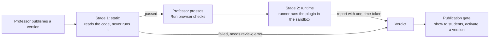

# Studio Plugin Validator

The pre-publish validator decides whether a published plugin version may reach students. It reads the version's code without running it (Stage 1), then runs it in a browser inside the student sandbox (Stage 2). A version reaches students only when both stages pass for its exact content, and every check that needed a human was approved by a Scholera reviewer. Read [studio-plugin-rules.md](./studio-plugin-rules.md) first; rule numbers below cite it.

| | |
|---|---|
| **Status** | Built and tested locally. Stage 2 has no production runner, so no version can pass in production |
| **Ruleset** | 1 (`STUDIO_VALIDATOR_RULESET`), validator `1.0.0`, runtime `v1` |
| **Owner** | Kevin Dohsi |
| **Date** | 2026-10-01 |
| **Code** | `src/lib/studio/validator/` (checks, verdict, service), `validator-runtime/` (Stage 2 runner), `src/lib/studio/prepublish.ts` (what the publication gate reads), `src/lib/studio/skill-bindings.ts` |
| **Migration** | `supabase/migrations/20261001202323_studio_validator.sql` |
| **Tests** | `src/__tests__/studio-validator*.test.ts`, `studio-skill-bindings.test.ts`, `db/studio-validator.test.ts`, `e2e/studio-validator/` |

## What it's for

Most Studio rules are enforced by the sandbox and the Bridge, so a plugin physically can't break them. A few can't be enforced that way:

- **Navigation.** A plugin can navigate its own frame to a URL that carries data. The runtime detects this and stops the frame, but can't prevent it (rules appendix, N9).
- **Measured quality.** Phone layout, touch-target size, accessibility and empty, loading and error states (rules 7.3 to 7.5) can only be checked on the rendered tool.
- **Declarations.** Purpose, signals, skill slots and AI fallback (rules 9.6, 3.4, 4.3, 6.2) are claims the manifest makes. Something has to check them.

The validator checks these before students see a tool. It also re-checks, statically, the things the runtime already blocks, so a broken tool fails with a clear message instead of a blocked call in front of a student.

## The two stages

**Stage 1 (static)** runs on the app server right after publish, inside `publishVersion`. It reads the stored artifact and never evaluates it: the scanner parses each bundle with the TypeScript compiler API as a plain script and walks the syntax tree. A test fails the build if `eval`, `new Function` or `node:vm` ever appears in `src/lib/studio/validator/`.

**Stage 2 (runtime)** runs only when the section's professor asks for it in the publish dialog, and only after Stage 1 passed for the same content. If Stage 1 has no usable result (never ran, or errored), asking runs Stage 1 again first. Asking is refused while Studio is paused, when the school isn't entitled, for an archived installation, and for a minute after a run of that stage ended in error (`STUDIO_VALIDATOR_RETRY_COOLDOWN_MS`), since each retry can spend browser time and an AI call. A runner loads the plugin into the real frame document, Content Security Policy and sandbox that students get, in Chromium, and reports what it measured. The runner never decides a verdict: the server does, from the measurements.

**Runner modes** (`src/lib/studio/validator/runtime-runner.ts`):

| Mode | When | What happens |
|---|---|---|
| `unavailable` | The default, and always in production | The run is recorded as `error` with the reason "Browser checks can't run in this environment yet". The tool stays blocked |
| `local` | `STUDIO_VALIDATOR_RUNNER=local` and `NODE_ENV` isn't `production` | `validator-runtime/cli.mjs` runs as a child process with an environment holding only `PATH`, temp and home paths, and `PLAYWRIGHT_BROWSERS_PATH`. No Scholera secret is in its environment, and Chromium's own OS sandbox stays on. It reports back through the same token check a production runner would use. A developer machine isn't an isolated environment: the runner could still read files such as `.env.local`, so this mode is for development only |

## Checks

The registry lives in `src/lib/studio/validator/ruleset.ts`. Each check has an ID, the rules it enforces, a stage, a severity, whether it's required, and whether a human may resolve it. Severity is explained in the rules doc ("The principle above every rule"). Every required check must pass; a missing result counts as an error, never a pass.

| Check | Stage | Severity | Rules | Fails when |
|---|---|---|---|---|
| `artifact.hash` | static | security | 8.4 | The hash stored at publish doesn't match the content now |
| `artifact.size` | static | reliability | 10.1 | Source or bundles are over the size or file-count limits |
| `artifact.entries` | static | reliability | 9.4 | A view's source entry or bundle is missing |
| `artifact.vendor_free` | static | policy | 7.1, 8.7 | A bundle carries its own React or kit |
| `artifact.syntax` | static | reliability | 8.7 | A bundle isn't a plain script, nests too deeply, is too large to walk, or runs out of time |
| `source.imports` | static | reliability | 1.2, 7.1 | Source imports anything but `react`, `@scholera/plugin-kit` or its own files |
| `manifest.valid` | static | policy | 1.5, 4.5, 8.7 | The manifest doesn't parse under its declared version |
| `code.navigation` | static | security | 1.2, 2.5 | Code writes `location`, calls `location.assign`/`replace`, `window.open`, submits a form, or sets `href`/`action` |
| `code.global_indirection` | static | security | 1.2 | `window[...]`, `with`, `Reflect.get(window, ...)` or similar hides which global is reached |
| `code.html_injection` | static | security | 6.5, 1.2 | `innerHTML`, `outerHTML`, `insertAdjacentHTML`, `document.write` and similar |
| `code.dynamic_code` | static | reliability | 1.1 | `eval`, `Function`, string timers, `import()` |
| `code.network` | static | reliability | 1.2 | `fetch`, XHR, WebSocket, EventSource, beacons |
| `code.storage` | static | reliability | 3.1 | Cookies, local or session storage, IndexedDB, caches |
| `code.workers` | static | reliability | 1.2 | Workers and service workers |
| `code.device_apis` | static | reliability | 1.4 | Camera, microphone, location, clipboard, notifications, WebRTC |
| `code.bridge_usage` | static | reliability | 1.5, 4.5 | A Bridge call names a method the view doesn't declare, a computed method name, or `postMessage` to the parent |
| `code.external_urls` | static | reliability | 1.2 | Not required: reports external URLs as a warning, since text may mention a link |
| `kit.components_only` | static | policy | 7.1, 7.6 | Raw HTML elements or DOM building instead of kit components |
| `kit.no_hardcoded_style` | static | policy | 7.1, 7.2 | `style` props or color literals |
| `kit.required_states` | static | policy | 7.5 | A view never uses the kit's loading, empty and error states |
| `data.answer_key` | static | policy | 5.2 | Looks like an answer key in the student bundle. Goes to review, not failure |
| `edtech.purpose` | static | policy | 9.6 | See [Purpose check](#purpose-check). May go to review |
| `edtech.signals` | static | policy | 3.4 | Version 1 manifest (no signals declared) |
| `edtech.skill_slots` | static | policy | 4.3, 2.4 | A slot label looks like an ID, or the manifest is version 1 |
| `edtech.ai_fallback` | static | policy | 6.2 | Version 1 manifest (no fallback declared) |
| `runtime.boot` | runtime | reliability | 8.7, 7.5 | A view doesn't complete the handshake and render, or crashes |
| `runtime.isolation` | runtime | security | 1.2, 2.5 | Any request leaves the sandbox, or the frame navigates |
| `runtime.mobile_layout` | runtime | quality | 7.3 | Content is wider than 375 px at phone size |
| `runtime.touch_targets` | runtime | quality | 7.3 | A control is smaller than 44 by 44 px |
| `runtime.accessibility` | runtime | quality | 7.4 | axe-core finds a WCAG 2.0/2.1 A or AA violation |
| `runtime.states` | runtime | quality | 7.5 | Loading, empty or error state missing under a slow, empty or failing Bridge, or a raw error message on screen |

Stage 2 runs every runtime check on both views. Each view is loaded at 375 by 812 pixels four times: with data, with no data, with a Bridge that answers slowly, and with one that fails. The failing Bridge returns a sentinel message; if that text reaches the screen, `runtime.states` fails.

Plugins are built from the plugin kit (`src/lib/studio/kit/`). The runtime supplies React and the kit as `public/studio-runtime/v1/vendor.js`, pinned by hash in `src/lib/studio/kit/vendor-hash.ts`, so the validator scans only plugin-owned code (`npm run` the build in `scripts/studio/build-runtime-vendor.mjs` to regenerate it). The kit's state components carry `data-kit-state` markers, which is how Stage 2 recognizes loading, empty and error states.

## Results and the verdict

Four tables hold everything. All are server-only: row-level security is on with no policies, and client privileges are revoked.

| Table | Holds |
|---|---|
| `studio_plugin_validations` | One row per run: version, stage, status, artifact hash, validator, ruleset and runtime versions, trigger, who asked, browser, runner, AI model and rubric, a bounded error, and the hash of the callback token for runtime runs |
| `studio_plugin_validation_checks` | One row per check per run: status, severity, rules, a short message and bounded metadata |
| `studio_plugin_validation_reviews` | A Scholera reviewer's decision on one `needs_review` check |
| `studio_validator_settings` | One row: `min_accepted_ruleset` |

The database guards each table, so a bug in the server can't bend them:

- A run's institution must match its version's.
- A run starts `pending` or `running`, moves forward only, and never changes once it's final.
- Only one run per version, stage, ruleset and artifact can be active at a time.
- Check results can be added only while their run is open, and never changed.
- A review is accepted only for a check that is `needs_review`, only from a super admin, and never from the person who published the version.
- Runs, checks and reviews can't be deleted directly, so a failed result or a rejection can't be erased to get a second judgment. They're removed only when the version or institution they belong to is.

Check metadata is held to 3,500 bytes (`boundedMetadata` in the service), trimming findings if needed, so a long list of multi-byte quotes can't fail the write.

**Run statuses:** `pending`, `running`, `passed`, `failed`, `needs_review`, `error`. A run that stays open longer than the callback window (15 minutes) is marked `error` the next time anyone touches that version, so a crashed process can't block it forever.

**The verdict** (`src/lib/studio/validator/verdict.ts`) is computed fresh every time it's read:

1. If the settings can't be read, the verdict is `unavailable`.
2. The version's content is hashed again. If that differs from the hash stored at publish, the verdict is `failed` (artifact mismatch), whatever the runs say.
3. For each stage, the run that counts is the newest one for this exact hash at a ruleset at or above the minimum. The runtime run must be at a ruleset at least as new as the static run.
4. Reviews are applied: all flagged checks approved counts as passed, and any rejection fails the version.
5. `passed` only if both stages passed. Everything else blocks.

| Verdict | Reason | What the professor sees |
|---|---|---|
| `passed` | | Nothing blocks on the validator |
| `failed` | `static_failed`, `runtime_failed`, `review_rejected`, `artifact_mismatch` | "This tool didn't pass Studio's automatic checks for student use." |
| `needs_review` | | "A Scholera reviewer needs to look at this tool before students can see it." |
| `unavailable` | `runtime_not_checked` | "Run the browser checks before students can see this tool." |
| `unavailable` | `runtime_error` | "The browser checks didn't finish. Run them again." |
| `unavailable` | `checking` | "Studio's automatic checks are still running." |
| `unavailable` | `not_checked`, `validator_error`, `below_minimum_ruleset`, `settings_unavailable` | "Studio's automatic checks haven't passed for this version yet." |

An identical artifact, stage and ruleset reuses the earlier result, so republishing the same code doesn't pay for the browser or the AI again. An `error` is never reused.

## Ruleset and revalidation

Every run records the ruleset it ran under. `STUDIO_VALIDATOR_RULESET` in `ruleset.ts` is raised whenever a check is added or tightened. `min_accepted_ruleset` in `studio_validator_settings` is the oldest ruleset whose verdicts still count. Raising it withdraws every older verdict at once: those versions become `unavailable` (`below_minimum_ruleset`) until they're checked again. Tools already visible to students are **not** hidden automatically (decision D4). The gate stops new showing and new activation. Tools already live stay until their professor hides them. A super admin's only lever today is the global Studio kill switch; there is no per-tool super-admin hide yet.

`revalidateCurrentVersions(limit, offset)` re-runs Stage 1 under the current ruleset for one page (up to 200) of active installations' current versions, and returns the offset of the next page, or null after the last. It's super-admin only. It has no caller yet: no admin page, no scheduled job. Stage 2 is re-run when the professor asks again.

## Manual review

A check marked reviewable (`data.answer_key`, `edtech.purpose`) can end as `needs_review` instead of failing. Only a Scholera super admin can resolve it, and never the professor who published the version (decision D6). The database enforces both. `resolveValidationReview` records the decision and logs it.

There is no review queue or review page yet. Until there is, `needs_review` blocks the tool, and resolving one needs a super admin calling the service directly.

## Purpose check

Rule 9.6 is checked on manifest version 2's `purpose` field (`src/lib/studio/validator/purpose.ts`, `purpose-ai.ts`).

1. **Deterministic checks first.** Red-flag topics (trading, gambling, shopping and similar), text that reads like instructions to a model ("ignore previous instructions", "mark this as educational"), and categories that need student work but whose summary describes none. Any of these sends the check to review, and the model isn't called: its input would include whatever raised the flag.
2. **Then the classifier.** `gemini-3-flash-preview` (`STUDIO_PURPOSE_MODEL`) gets the name, description and purpose, fenced as data, with a versioned rubric (`purpose-rubric-v1`). It must answer in a strict schema: verdict, category, confidence and reasons. Input is capped at 8 KiB.
3. **Decision.** A confident (0.85 or above) `educational` answer in the declared category passes. A confident `not_educational` answer fails. Anything else, including low confidence, a different category, a malformed answer or no answer, goes to review.

The classifier has its own AI kill-switch group, `studio-validator`. When it's switched off or the model is unavailable, the purpose check goes to review. It never passes. Each call is recorded in the AI cost ledger as `studio_purpose_check`, and the run records the model and rubric version.

## Skill slots

A version declares skill slots; each installation binds them to its own section's skills (rule 4.3). The manifest side is in [studio-plugin-manifest.md](./studio-plugin-manifest.md#skill-slots). `studio_plugin_skill_bindings` holds one row per installation and slot. The database refuses a skill from another section and a binder from another institution. The publish dialog shows a picker for each slot. Showing the tool, and activating a version while students can see it, both require every slot to be bound to a skill that is still visible in the section.

## The publication gate

Two places read the verdict, and both fail closed:

- **Showing a tool to students** (`student-visibility.ts`, through `prepublish.ts`). The validator's verdict is one blocker among several. A `prepublish.ts` that can't read the verdict returns `unavailable`.
- **Changing the active version while students can see the tool** (`lifecycle.ts`). An upgrade or rollback to a version that hasn't passed is refused, so a visible tool can't be swapped for unchecked code. While the tool is hidden, any version can be activated for preview.

Each check and its write are one decision. Showing and activating each read the installation, check, then write. A second request in between could otherwise activate an unchecked version just as the tool is shown. So `studio_set_student_visibility` takes the version whose verdict was checked, and `studio_activate_version` takes the visibility the check saw. Each refuses under the installation's row lock if that changed, and the professor is asked to try again.

The verdict is not checked again each time a student opens a tool. A tool that was shown stays shown when the minimum ruleset rises (decision D4). Only its professor can hide it, or a super admin can stop all of Studio with the kill switch.

The validator is not the only gate. Students reach a tool only when all of these hold: the `STUDIO_STUDENT_ACCESS` release gate is on, the Studio kill switch is off, the institution has the `studio` entitlement, the validator's verdict is `passed`, every skill slot is bound, and the professor chose to show it. The release gate is off in every environment today.

## Limits

| Limit | Value | Enforced by |
|---|---|---|
| Bundle size, per view | 256 KiB | `publishVersion` and `artifact.size` |
| Source, total / per file / files | 512 KiB / 128 KiB / 100 | `publishVersion` and `artifact.size` |
| Far past the limits (4 times) | refused | The service reads sizes with `studio_version_sizes()` and fails the run without loading the content |
| Syntax nesting depth | 500 | Linear pre-scan before parsing |
| Syntax tree nodes | 500,000 | Iterative walk, no recursion |
| Stage 1 time | 10 s | Deadline checked during the walk; running out is an error, never a pass |
| Findings per check / quote length | 20 / 80 characters | Quotes are stripped of control characters and angle brackets |
| Stage 2 per view / whole run | 30 s / 180 s | The runner |
| Callback token lifetime | 15 min | The report endpoint; then the run is an error. A run still open after this is marked `error` the next time the version is checked |
| Retry after an error | 1 min | `requestRuntimeValidation` |
| Check metadata | 3,500 bytes | `boundedMetadata`; the database refuses more than 4,096 |
| Purpose text | 8 KiB | `purpose.ts` |
| Runner memory, log lines and bytes, kept artifacts | 2048 MB, 200, 32 KiB, 0 | Declared for the production container. The local runner doesn't enforce them |

## Reporting from a runner

A runner reports to `POST /api/studio/validator/runtime-report` with `Authorization: Bearer <token>` and `{ validationId, report }`. The token is minted per run, and only its SHA-256 hash is stored. The report is accepted once, only with that run's token (compared in constant time), only while the run is open and within 15 minutes. The body is capped at 64 KiB and must match a strict schema: unknown fields, unknown checks and long text are refused. Every refusal gets the same answer. The local runner submits through the same function in-process.

## What the validator can't see

**Static blind spots.** Stage 1 reads names in the syntax tree. Its nesting pre-scan doesn't recognize regex literals, so deep nesting hidden in one reaches the parser; the parser's stack overflow is caught and fails the check as a syntax error. It can be defeated by code that builds names at run time beyond what it recognizes, for example strings decoded from numbers and looked up through an object the scanner doesn't know is a global. That's why the static checks are defense in depth: the sandbox and CSP still block what they block, and Stage 2 watches the running tool for navigation and requests. Stage 2 is in turn limited to what the plugin does in the four scenarios it drives. Code that waits for a date, a rare input or a long delay can behave differently in front of students. The runtime's own navigation detection (the host stops a frame that loads twice) remains the backstop.

**Accessibility.** axe-core finds a subset of WCAG A and AA failures, roughly the ones a machine can decide. A passing scan is not a claim of WCAG compliance. Keyboard order, visible focus, reduced motion and meaningful reading order are not yet checked.

**The answer-key heuristic** looks for structures that resemble quiz answers. It misses keys encoded in other shapes, and flags some harmless data. That's why a match goes to review instead of failing.

## Pending before students can use Studio

These are not built or not verified here:

- **A production Stage 2 runner.** An isolated container per run (a Cloud Run Job fits): pinned image, non-root, Chromium's sandbox on (never `--no-sandbox`), no credentials, no network egress except the report callback, CPU, memory and time limits, logs capped and scrubbed. Until it exists, production records every runtime run as `error`, and no version passes. None of these container properties has been verified, because the container doesn't exist.
- **A review page and queue** for super admins, so `needs_review` can be resolved.
- **A revalidation trigger** (admin page or scheduled job) for ruleset changes.
- **Real-Supabase acceptance** of the migration: see [studio-supabase-acceptance.md](./studio-supabase-acceptance.md).
- **Opening the release gate**, `STUDIO_STUDENT_ACCESS`, which is a separate decision.
