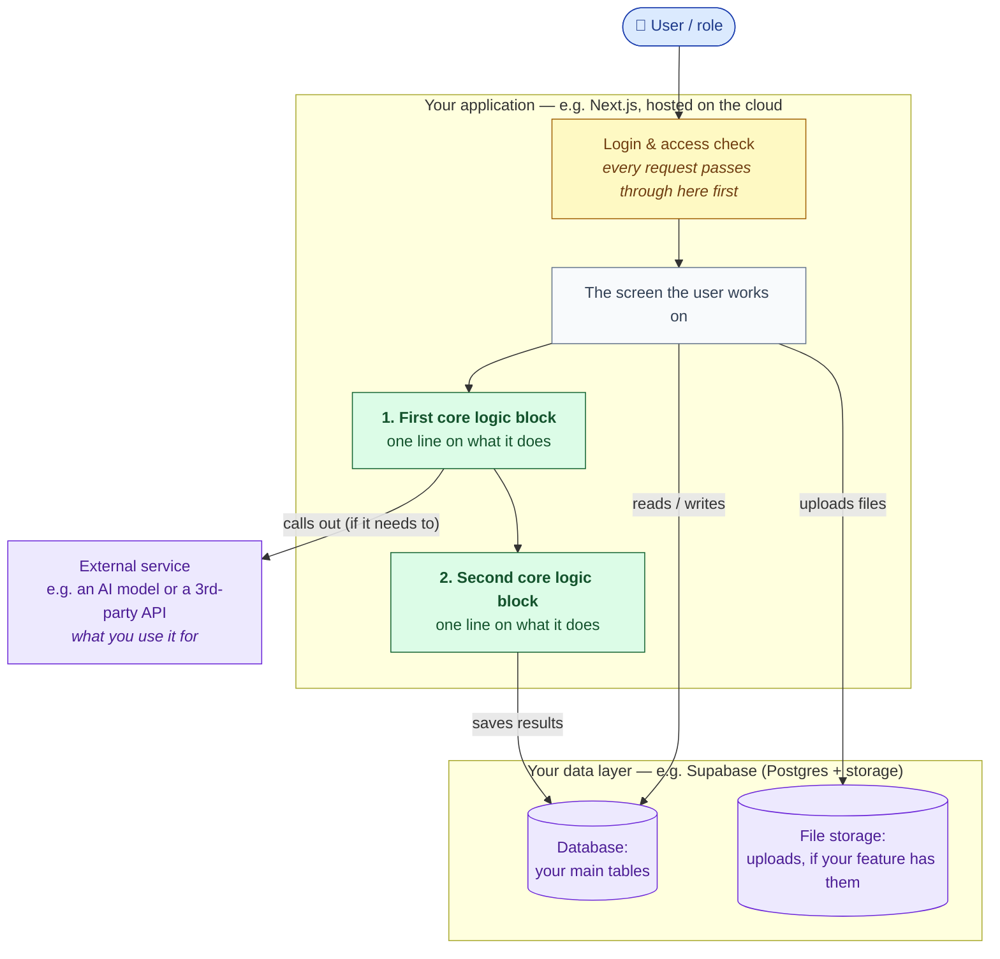

# System Design Rules

How we do system design at Scholera. Read the rules, follow the workflow, copy the
template at the bottom. The whole point: **a system design is one clear picture of how a
feature wires into the rest of the app** — fast to read, fast to change, and the thing
that builds the context before any code gets written.

## Why we do this

- One diagram per feature beats hundreds of lines of generated docs nobody reads. Across a few engineers and a dozen features, prose docs become 1,000+ lines no one opens; a diagram stays glanceable.
- Designing it forces *you* to understand the feature before you build it. You learn by doing, and that makes development faster.
- Claude can write the code in minutes — the hard part is building the **context** for what to build. The design *is* that context. And it's far faster to add/remove/rethink one block on a diagram than to rewrite long docs or code.

## When you need one

- **Non-trivial work** (new feature, new page, multi-file change) → **yes, design first.**
- **Small fixes** (typo, one-liner, config tweak) → skip it.

## The rules — what every system design must have

1. **One page, one diagram.** Not five diagrams, not a 300-line essay. If it doesn't fit on a page, the feature is probably too big a chunk — split it.
2. **Readable by an outsider.** The test: *could someone who has never seen our code — even a non-engineer — understand the feature from this?* If not, simplify the words.
3. **Important logic as its own labelled boxes.** Don't hide the interesting parts (scoring, matching, an AI pipeline) inside a vague "backend" block. The boxes that hold the real decision-making are the whole point — call them out.
4. **Name the technologies.** List the tools/libraries you used and one line on *why* each.
5. **Plain language, minimal jargon.** Spell out acronyms; describe effects, not internals.
6. **Spell out the hard parts.** Any algorithm or multi-step data pipeline gets described in plain rules + edge cases — this is what reviewers scrutinise hardest.
7. **Confirm it's safe.** State that the multi-tenant rules hold: ownership checks before DB writes, RLS isolation, secrets server-only (see the **Security** section in `CLAUDE.md`).
8. **Don't over-engineer it.** Match the design's depth to the feature. One clear picture + a few short sections is the goal, not a design-system overhaul.

## How to make one

- **Claude sketches, you shape.** Ask Claude (or the `mermaid` skill) for a first-pass Mermaid diagram to react to instead of a blank page — then refine it into something *you* understand and own. Don't outsource the whole design; if Claude does the thinking, you've skipped the part that helps you.
- **Tools — pick whatever's comfortable:** Mermaid (render it with the VS Code "Markdown Preview Mermaid Support" extension or on GitHub), or **Miro** / **draw.io** if you'd rather sketch visually and embed the export.
- **Save it to `docs/designs/`** and get a quick sign-off **before** writing implementation code.
- **Learn the craft (optional):** the classic "design X" walkthroughs are great for *how to think and communicate* a design — but they're heavier, large-scale-system style; ours is lighter (one page, one diagram):
  - Designing Spotify — https://www.youtube.com/watch?v=_K-eupuDVEc
  - Designing Twitter — https://www.youtube.com/watch?v=Nfa-uUHuFHg
  - Designing TikTok — https://www.youtube.com/watch?v=07BVxmVFDGY

---

# The Template

> **Copy everything below into a new file in `docs/designs/` and fill it in for your
> feature.** The lines in _italic blockquotes_ are **instructions** — delete them and
> replace with your own content. The diagram is **Mermaid** (renders on GitHub and in VS
> Code's preview); a Miro or draw.io picture works just as well.

| | |
|---|---|
| **Feature** | _your feature name_ |
| **Author** | _your name_ |
| **Status** | Draft → Review → Approved |
| **Date** | _today_ |

---

## 1. What it does (in one paragraph)

> _Plain-English summary a non-engineer could follow. Who uses it, what they can do, and
> what the system does for them. No tech names yet — just the story of the feature._

## 2. The big picture (one diagram)

> _This is the heart of the doc. Draw the whole feature as boxes and arrows. Keep the
> **shape** shown below, but replace the boxes with **your** feature's real parts:_
> - _**who uses it** (the people / roles)_
> - _the **access check** every request goes through_
> - _the **screens** users interact with_
> - _your **important logic as its own labelled, numbered boxes** — this is the part
>   reviewers care about, so don't bury it_
> - _where **data lives** (database, file storage)_
> - _any **external service** you call (an AI model, a payment API, an email service…)_

> _Tip: colour-code the boxes by kind (people, screens, logic, data, external) like
> above — it makes the picture readable at a glance. Highlight your logic boxes; they're
> the focus._

## 3. The main journey(s), step by step

> _Walk through the 1–2 most important paths a user takes, as short numbered steps. This
> turns the diagram into a story. Example shape:_
>
> **A [user] doing [the main thing]:**
> 1. _They start on [screen]; the request goes through the access check._
> 2. _[Logic block 1] does X…_
> 3. _…then [logic block 2] does Y and saves the result to the database._
> 4. _They see [the outcome]._
>
> _Keep it to the happy path plus any step that's genuinely important (e.g. "a human
> reviews before anything is published")._

## 4. The hard part — your core logic / algorithm

> _Every feature has one or two parts that are more than just "save to the database" —
> the actual decision-making. Spell it out in plain terms, because this is what a
> reviewer scrutinises hardest. Examples of "hard parts": how something is scored,
> ranked, matched, priced, scheduled, graded, or transformed._
>
> _Describe the **rules and the edge cases**, not the line-by-line code. A small table or
> a short list usually does it. For example, if your feature scores something:_
>
> | Case | Rule |
> |---|---|
> | _Normal case_ | _how it's handled_ |
> | _Edge case A_ | _what happens (and why you chose that)_ |
> | _Edge case B_ | _what happens_ |
>
> _Call out the deliberate decisions ("we round down", "we never penalise X", "ties go
> to Y") so reviewers can challenge them now instead of in production._

## 5. Any data pipeline (only if your feature has one)

> _If data flows through a multi-step process before it's useful — e.g. a file gets
> uploaded, parsed, transformed, sent to an AI, and stored — show it as a single
> left-to-right flow so no step is hidden as "magic":_
>
> > _**Raw input** → **Step 1 (what reads/cleans it)** → **Step 2 (what transforms it)** →
> > **Step 3 (external call, if any)** → **stored result**_
>
> _Then flag the 1–2 things a reviewer should know: where the data comes from, what
> happens if a step fails, and anything you deliberately don't trust (e.g. AI output is
> validated before use). Delete this section if your feature has no such pipeline._

## 6. Technologies & libraries

> _List what you actually used and **why** — one line each. Most of our features share
> the stack below, so it's a sensible default — but swap, add, or remove rows to match
> reality. Don't list anything you didn't use._

| Part of the system | Tool used | Why |
|---|---|---|
| The web app | **Next.js** (React) | Builds the screens and runs the behind-the-scenes logic in one place |
| Database & login | **Supabase** (Postgres + Auth) | Stores the data and handles user sign-in |
| File storage | **Supabase Storage** | Holds any uploaded files (_only if your feature uploads files_) |
| External service | _e.g. **Google Gemini**, a payment API, an email service_ | _what you call it for_ |
| Hosting | **Google Cloud Run** (via Docker) | Where the app actually runs |
| Tests | **Vitest** / **Playwright** | Confirms the important logic and access rules behave correctly |

## 7. The data we store

> _List the main tables your feature adds or touches, one line each on what they hold. No
> need for every column — just enough that a reader knows what's stored where._
>
> - _**Table A** — what one row represents_
> - _**Table B** — what one row represents_

## 8. Keeping data safe

> _Our app is multi-tenant — every institution's data must stay isolated. In your own
> words, confirm the three things below hold for your feature (this is a hard standard,
> not optional):_
>
> - _Every action checks **who you are** and **whether you're allowed** before touching the database — assume an attacker calls it with no permission._
> - _The database itself enforces that you can only ever see **your own tenant's** data (Row-Level Security), as a final safety net._
> - _Secrets (API keys, the master database key) live **only on the server** and never reach the browser._

## 9. Open questions / things we're assuming

> _Be honest about the shaky bits — assumptions you're making, decisions that could go
> either way, things you'd want a reviewer to push on. A short bullet list._
>
> - _Assumption 1…_
> - _Open question 1…_
> - _**If your feature uses AI:** also include a small set of example inputs/outputs that
>   define "good" results, and a rough cost estimate at 100 / 1,000 / 10,000 users — see
>   `docs/reference/athena-cost-analysis.md`._
> - _**If your feature touches vector search (embeddings / RAG / semantic search):** answer
>   the decision guide in `.claude/rules/vector-db.md` here — which **index** (existing, or
>   why a new one), how **tenant scoping** works (namespaces are derived, never picked),
>   what **content** gets embedded and its sensitivity class, and which **retrieval
>   profile**. The default answer to each is "the existing one"; every deviation needs one
>   paragraph of why._
